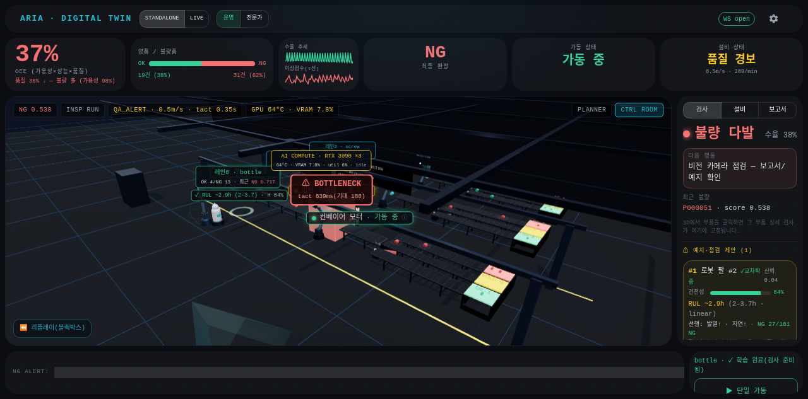
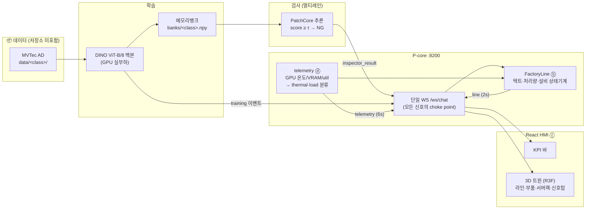

# 👁️ ARIA: Anomaly Reasoning Intelligence Agent

**산업 비전 검사 × 디지털 트윈 스마트팩토리.**
결정론 검사 파이프라인(DINO+PatchCore) 위에 **현실적 공장 거동 모델(ⓑ)**, **R3F 3D 트윈 HMI(ⓒ)**,
**실측 GPU 텔레메트리 연동(ⓓ)** 을 얹었습니다. 아래 캡처는 실제 가동 화면입니다.



> **실제 가동 캡처** (MVTec AD 실데이터 · PatchCore 실추론 · RTX 3090×3)
> - **상단 KPI**: OEE 37% · 양품/불량 19:31 · 수율 추세 · 최종 판정 `NG` · 설비 상태 `품질 경보 · 0.5m/s · 209/min`
> - **3D 뷰포트**: 3개 검사 라인 동시 가동(레인0 bottle · 레인1 cable · 레인2 screw), 부품 흐름(녹=OK/적=NG),
>   `⚠ BOTTLENECK` 진단, 설비 상태 라벨, 순찰로봇, 예지 링 `RUL ~2.9h · H 84%`
> - **GPU 서버랙(3D)**: `AI COMPUTE · RTX 3090 ×3 — 64°C · VRAM 7.8%` (pynvml 실측이 그대로 3D에)

---

## 데이터 흐름 — 어떻게 돌아가는가



**설비 상태기계 (우선순위 내림차순, 결정론 — LLM 없음):**

| 상태 | 조건 | 3D 반영 |
|---|---|---|
| `THERMAL_FAULT` | GPU thermal critical(≥84°C) | 컨베이어 ×0.35 감속 + 적색 경보 |
| `MODEL_TRAINING` | 학습 이벤트 또는 GPU 학습부하 실측 | 서버랙 보라 펄스 코어 |
| `QA_ALERT` | 불량률 > 목표(기본 30%) | Andon 신호탑 적색 점멸 |
| `RUNNING` / `IDLE` | 최근 검사 유무 | 벨트 가동/정지 |

---

## 검증된 E2E 시나리오 (실측 기록)

| 시각 | 이벤트 | 증거 |
|---|---|---|
| t=2.1s | bottle 학습 시작 (DINO 209장, GPU 실부하) | `training` 이벤트 211건 |
| t=2.6s | 라인 `IDLE → MODEL_TRAINING` | ⓑⓓ 연동 (0.5초 내) |
| t=26.8s | 학습 완료 → 뱅크 12MB | `banks/bottle.npy` |
| t=54.7s~ | PatchCore 실검사 80건 (히트맵 포함) | `inspector_result` |
| t=57.7s | 라인 `→ QA_ALERT` (불량률 61%>30%) | 택트 0.69s 실측 |

- **가상 FAT 게이트 PASS**: escape 4.8%(3/63) ≤ 5% · FP 5% ≤ 20% · 임계값 μ+3σ 자동 산출
- **3레인 동시성**: 모든 2초 창에서 3레인 동시 생산, 합산 처리량 202/min(이론 216/min)
- **GPU 스트레스 연동**: torch 실부하(util 100%·VRAM 50%·80°C) → `MODEL_TRAINING` 전환, 부하 종료 → 자동 복귀

---

## 프로젝트 구조

```
server/              P-core API (:8200) — 라우터·단일 WS·트윈 방송 루프
  ws.py              모든 신호의 choke point (+ FactoryLine 급전 탭)
  routers/twin.py    /api/twin/* + line(2s)·telemetry(6s) 방송
aria/
  planes/factory_line.py   ⓑ 공장 거동 모델 (택트 EMA·처리량 윈도·상태기계·발열 감속)
  planes/twin_state.py     트윈 상태 단일 진실원 (+레인 세대 토큰)
  inspection/              async_pipeline · detectors(PatchCore/YOLO) · pdm_fusion · RUL
  perception/              DINO 백본 · scorer · threshold_calibrator
hardware/
  monitor.py               원시 스냅샷 (pynvml/psutil)
  telemetry.py             ⓓ thermal(cool→critical)·load(idle/light/training) 분류
frontend/src/hmi/          ⓒ React HMI 단일 화면
  scene/QCLine.jsx         3D 공장 씬 (레인 N개·전광판·신호탑)
  scene/prefabs/GpuRack.jsx  GPU 서버랙 — 실측 온도/VRAM/util → 색·팬·게이지
tests/                     pytest (factory_line 상태기계·텔레메트리 분류 등)
docs/specs/                설계 명세 60편
```

## 설치 및 실행

**환경: conda env (Python 3.10 + Node 20)** · GPU: NVIDIA (드라이버 12.4 기준)

```bash
# 1) 환경 (최초 1회)
conda create -n aria python=3.10 nodejs=20 -c conda-forge -y
pip install -r requirements.txt          # faiss-gpu는 선택
# ⚠️ torch는 드라이버에 맞는 CUDA 빌드로 (예: 드라이버 12.4 → cu124)
pip install torch==2.5.1 torchvision==0.20.1 --index-url https://download.pytorch.org/whl/cu124

# 2) 데이터셋 (저장소 미포함 — MVTec AD를 받아 data/에 해제)
#    https://www.mvtec.com/company/research/datasets/mvtec-ad
tar -xJf mvtec_anomaly_detection.tar.xz -C data/

# 3) 프론트 빌드
cd frontend && npm install && npm run build && cd ..

# 4) 서버 기동 → http://<host>:8200/
python -m uvicorn server.app:app --host 0.0.0.0 --port 8200

# 5) 학습 → 검사 (bottle 예시)
curl -X POST localhost:8200/api/class/train -H "Content-Type: application/json" \
  -d '{"classId":"bottle","mvtec_path":"'$PWD'/data/bottle"}'
curl -X POST localhost:8200/api/inspector/start_lanes -H "Content-Type: application/json" \
  -d '{"mode":"patchcore","lane_count":3,"line_hz":1.2}'

# 정지 (검사 정지 + 프로세스 종료 + GPU VRAM 해제 확인)
./stop_aria.sh
```

## 주요 엔드포인트

| 경로 | 설명 |
|------|------|
| `WS /ws/chat` | 단일 신호 채널 — `inspector_*` · `line`(2s) · `telemetry`(6s) · `training` |
| `GET /api/twin/snapshot` | 라인 지표(ⓑ) + 통계 + GPU 요약(ⓓ) |
| `GET /api/twin/telemetry` | GPU별 온도/VRAM/util + thermal/load 분류 |
| `POST /api/twin/config` | 컨베이어 속도·라인 길이·불량 목표 변경 |
| `POST /api/class/train` | 클래스 학습(메모리뱅크) — 학습 중 라인 `MODEL_TRAINING` |
| `POST /api/inspector/start` | 단일 라인 검사 (mock/patchcore/combined) |
| `POST /api/inspector/start_lanes` | 멀티레인 동시 검사 (학습된 클래스 자동 순환) |

## 테스트

```bash
python -m pytest tests/ -q     # 상태기계·발열 감속·텔레메트리 분류·중복 방지 등
```

---

## 👤 Author

정세훈 (JUNG SEHOON) — [JUNGSEHOON-AutoML](https://github.com/JUNGSEHOON-AutoML)
