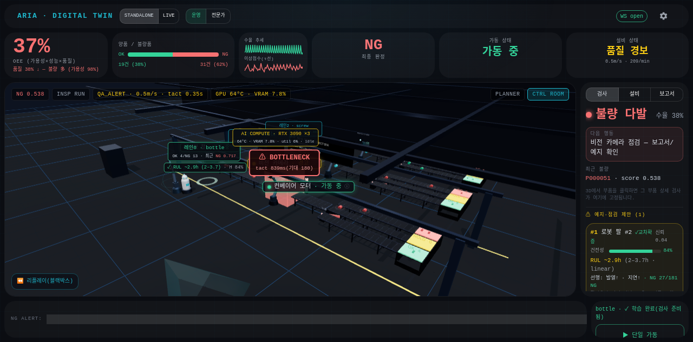
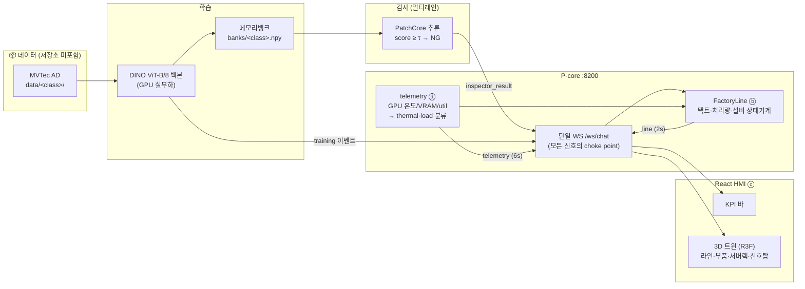

# ARIA — Autonomous Industrial Simulation & AI Agent

**3D 공정 편집, 이산 사건 시뮬레이션(DES), CCIFPS 검사 연결, 휴머노이드 순찰 및 문제 보고를 통합한 산업 시뮬레이션 워크스페이스입니다.** 상단의 **Factory**에서 공정을 설계·실행하고, **QC Live**에서 기존 비전 검사 화면을 사용할 수 있습니다.

## 구현된 기능

| 영역 | 구현 내용 |
|---|---|
| 공정 설계 | Source / Conveyor / Buffer / Machine / Inspection / Diverter / Sink 배치, 연결, 속성 편집, JSON 저장·불러오기 |
| 시뮬레이션 | 이벤트 큐 기반 DES, 유한 버퍼, 처리·정체·자재 부족·고장 상태, 실행/정지/단계 진행/배속/초기화 |
| 공정 분석 | 처리량, 양품 생산량, WIP, 리드타임, 불량률, OEE V1, 자원별 병목 및 시나리오 비교 |
| 3D 설비 | CNC 하우징, 로봇팔, 안전 펜스, 검사 부스·카메라, 컨베이어, 팔레트·자재함, 공장 전체/평면/셀 확대 보기 |
| CCIFPS 연결 | 실제 CCIFPS 추론 어댑터와 검사 결과에 따른 분기. 데이터·모델 미준비 시 검사 누락 사유를 기록 |
| 순찰 로봇 | ARIA-01 / ARIA-02 휴머노이드가 설비 점유 영역을 피해 A* 경로로 이동. 생산 일시정지 중에도 순찰 지속 |
| 문제 보고 | DOWN, 물류 정체, 자재 부족, 검사 누락 감지. 근거·감지 시각·현장 확인 로봇·복구 상태 기록 및 Markdown 다운로드 |
| 공정 에이전트 | 병목 분석, 비교 실험, 검토 가능한 변경 제안. 공장 모델 변경은 사용자 승인 후 적용. 채팅/MCP에서 문제 보고 조회 |

기본 공정 데모와 순찰·보고는 API 키 없이 동작합니다. 순찰 보고는 **가상 공장의 실제 DES 신호를 사용하는 규칙 기반 기능**입니다. 보행 애니메이션과 평면 경로 계획을 제공하며, 물리 기반 보행·로봇 간 충돌 회피·실제 설비 진단·자동 수리는 구현하지 않았습니다. CCIFPS 실검사는 별도 데이터와 모델 준비가 필요합니다.

## 현재 워크스테이션에서 실행

이미 구성된 `aria` 환경을 기준으로 실행합니다. 최초 환경 구성은 아래 기존 QC Live 안내를 참고하세요.

```bash
cd /userHome/userhome4/sehoon/Aria-virual-industrial-main
conda activate aria
cd frontend
npm run build
cd ..
python -m uvicorn server.app:app --host 127.0.0.1 --port 8230
```

브라우저에서 <http://localhost:8230/>에 접속합니다.

1. **Factory → Run**으로 생산 흐름과 KPI를 확인합니다.
2. 설비를 선택하고 **Cell close-up**으로 로봇팔·검사 부스를 확대합니다.
3. **Patrol** 탭에서 두 로봇의 이동·관측 상태를 확인합니다.
4. **고장 시나리오 실행**은 선택한 설비에 60초의 가상 고장을 주입하고 생산을 시작합니다. 시뮬레이션 배속에 따라 실제 경과 시간은 달라집니다.
5. 고장 감지와 로봇 도착 후 현장 확인을 구분해 확인하고, **문제 보고서** 또는 **Download report**로 기록을 조회합니다.

모델·시나리오는 `outputs/factory/factory.json`, 최근 200개 사건은 `outputs/factory/patrol_reports.json`에 저장합니다. `ARIA_FACTORY_STATE_DIR`로 저장 위치를 바꿀 수 있습니다. 런타임 데이터·모델·자격 증명은 Git에 포함하지 않습니다.

## 실제 구동 화면 — 2026-09-17

아래는 실행 중인 앱을 Chrome에서 직접 캡처한 화면입니다. 이번 캡처의 검사 셀은 MOCK 데모 모드이며 CCIFPS 실추론 성능 증거가 아닙니다. 첫 네 장은 생산 실행 중이며, 마지막 장은 누적 사건에 대한 보고 조회입니다. 보고서에는 명시적으로 실행한 가상 고장 시나리오의 기록도 포함됩니다.

### 1. 공장 전체 가동과 순찰 팀


### 2. CNC·로봇팔 작업 셀 확대


### 3. 비전 검사 셀 확대


### 4. 공정 배치 평면 보기


### 5. 순찰 사건과 에이전트 문제 보고


## 검증 및 상세 문서

- Python 전체 테스트 **59개 통과**, 프런트엔드 production build 통과(대형 번들 경고 존재).
- 실제 브라우저에서 **고장 주입 → ARIA-01 현장 확인 → recovered 기록** 검증. 해당 검증의 브라우저 예외·HTTP 오류 0건.
- [공정 시뮬레이션 구현·API·실험 보고서](docs/INDUSTRIAL_V1_REPORT.md)
- [순찰·문제 보고 구현 및 검증](docs/PATROL_AGENT_REPORT.md)
- [공정 에이전트 명세](docs/specs/INDUSTRIAL_SIM_AGENT_V1.md)
- [작업 진행 기록](docs/CODEX_PROGRESS.md)

주요 코드: `aria/simulation/des/`(엔진·검사·순찰·에이전트), `server/routers/factory.py`(API), `frontend/src/hmi/factory/`(3D/UI), `aria/mcp/servers/factory_mcp.py`(MCP).

---

## 기존 QC Live 구현 및 이전 검증 기록

이하 영상·수치·실험 환경은 기존 QC Live의 기록입니다. 위 Factory 워크스페이스의 최신 순찰 검증과는 별개의 실행 결과입니다.

### QC Live — Anomaly Reasoning Intelligence Agent

**산업 비전 검사 × 디지털 트윈 스마트팩토리.**
결정론 검사 파이프라인(DINO+PatchCore) 위에 **현실적 공장 거동 모델(ⓑ)**, **R3F 3D 트윈 HMI(ⓒ)**,
**실측 GPU 텔레메트리 연동(ⓓ)** 을 얹었습니다. 아래 캡처는 실제 가동 화면입니다.


> **실제 가동 영상 31.5초** (MVTec AD 실데이터 · PatchCore 실추론 · RTX 3090×3 · 헤드리스 크롬 GPU 렌더 녹화)
> — 부품이 컨베이어를 흐르며 OK(녹)/NG(적) 분류되고, 병목 진단·순찰로봇·수리 에이전트가 동작합니다.
> 고화질 MP4: [docs/images/hmi_live.mp4](docs/images/hmi_live.mp4)



> **정지 캡처 상세** (같은 화면)
> - **상단 KPI**: OEE 37% · 양품/불량 19:31 · 수율 추세 · 최종 판정 `NG` · 설비 상태 `품질 경보 · 0.5m/s · 209/min`
> - **3D 뷰포트**: 3개 검사 라인 동시 가동(레인0 bottle · 레인1 cable · 레인2 screw), 부품 흐름(녹=OK/적=NG),
>   `⚠ BOTTLENECK` 진단, 설비 상태 라벨, 순찰로봇, 예지 링 `RUL ~2.9h · H 84%`
> - **GPU 서버랙(3D)**: `AI COMPUTE · RTX 3090 ×3 — 64°C · VRAM 7.8%` (pynvml 실측이 그대로 3D에)

---

## 데이터 흐름 — 어떻게 돌아가는가


```mermaid
flowchart LR
    subgraph DATA["📦 데이터 (저장소 미포함)"]
        MV["MVTec AD<br/>data/&lt;class&gt;/"]
    end
    subgraph TRAIN["학습"]
        BB["DINO ViT-B/8 백본<br/>(GPU 실부하)"]
        BK["메모리뱅크<br/>banks/&lt;class&gt;.npy"]
    end
    subgraph INSPECT["검사 (멀티레인)"]
        PC["PatchCore 추론<br/>score ≥ τ → NG"]
    end
    subgraph CORE["P-core :8200"]
        WS["단일 WS /ws/chat<br/>(모든 신호의 choke point)"]
        FL["FactoryLine ⓑ<br/>택트·처리량·설비 상태기계"]
        TEL["telemetry ⓓ<br/>GPU 온도/VRAM/util<br/>→ thermal·load 분류"]
    end
    subgraph HMI["React HMI ⓒ"]
        K["KPI 바"]
        T["3D 트윈 (R3F)<br/>라인·부품·서버랙·신호탑"]
    end

    MV --> BB --> BK --> PC
    PC -- "inspector_result" --> WS
    BB -- "training 이벤트" --> WS
    WS --> FL
    TEL --> FL
    FL -- "line (2s)" --> WS
    TEL -- "telemetry (6s)" --> WS
    WS --> K & T
```

**설비 상태기계 (우선순위 내림차순, 결정론 — LLM 없음):**

| 상태 | 조건 | 3D 반영 |
|---|---|---|
| `THERMAL_FAULT` | GPU thermal critical(≥84°C) | 컨베이어 ×0.35 감속 + 적색 경보 |
| `MODEL_TRAINING` | 학습 이벤트 또는 GPU 학습부하 실측 | 서버랙 보라 펄스 코어 |
| `QA_ALERT` | 불량률 > 목표(기본 30%) | Andon 신호탑 적색 점멸 |
| `RUNNING` / `IDLE` | 최근 검사 유무 | 벨트 가동/정지 |

---

## 검증된 E2E 시나리오 (실측 기록)

| 시각 | 이벤트 | 증거 |
|---|---|---|
| t=2.1s | bottle 학습 시작 (DINO 209장, GPU 실부하) | `training` 이벤트 211건 |
| t=2.6s | 라인 `IDLE → MODEL_TRAINING` | ⓑⓓ 연동 (0.5초 내) |
| t=26.8s | 학습 완료 → 뱅크 12MB | `banks/bottle.npy` |
| t=54.7s~ | PatchCore 실검사 80건 (히트맵 포함) | `inspector_result` |
| t=57.7s | 라인 `→ QA_ALERT` (불량률 61%>30%) | 택트 0.69s 실측 |

- **가상 FAT 게이트 PASS**: escape 4.8%(3/63) ≤ 5% · FP 5% ≤ 20% · 임계값 μ+3σ 자동 산출
- **3레인 동시성**: 모든 2초 창에서 3레인 동시 생산, 합산 처리량 202/min(이론 216/min)
- **GPU 스트레스 연동**: torch 실부하(util 100%·VRAM 50%·80°C) → `MODEL_TRAINING` 전환, 부하 종료 → 자동 복귀

---

## 프로젝트 구조

```
server/              P-core API (:8200) — 라우터·단일 WS·트윈 방송 루프
  ws.py              모든 신호의 choke point (+ FactoryLine 급전 탭)
  routers/twin.py    /api/twin/* + line(2s)·telemetry(6s) 방송
aria/
  planes/factory_line.py   ⓑ 공장 거동 모델 (택트 EMA·처리량 윈도·상태기계·발열 감속)
  planes/twin_state.py     트윈 상태 단일 진실원 (+레인 세대 토큰)
  inspection/              async_pipeline · detectors(PatchCore/YOLO) · pdm_fusion · RUL
  perception/              DINO 백본 · scorer · threshold_calibrator
hardware/
  monitor.py               원시 스냅샷 (pynvml/psutil)
  telemetry.py             ⓓ thermal(cool→critical)·load(idle/light/training) 분류
frontend/src/hmi/          ⓒ React HMI 단일 화면
  scene/QCLine.jsx         3D 공장 씬 (레인 N개·전광판·신호탑)
  scene/prefabs/GpuRack.jsx  GPU 서버랙 — 실측 온도/VRAM/util → 색·팬·게이지
tests/                     pytest (factory_line 상태기계·텔레메트리 분류 등)
docs/specs/                설계 명세 60편
```

## 설치 및 실행

**환경: conda env (Python 3.10 + Node 20)** · GPU: NVIDIA (드라이버 12.4 기준)

```bash
# 1) 환경 (최초 1회)
conda create -n aria python=3.10 nodejs=20 -c conda-forge -y
pip install -r requirements.txt          # faiss-gpu는 선택
# ⚠️ torch는 드라이버에 맞는 CUDA 빌드로 (예: 드라이버 12.4 → cu124)
pip install torch==2.5.1 torchvision==0.20.1 --index-url https://download.pytorch.org/whl/cu124

# 2) 데이터셋 (저장소 미포함 — MVTec AD를 받아 data/에 해제)
#    https://www.mvtec.com/company/research/datasets/mvtec-ad
tar -xJf mvtec_anomaly_detection.tar.xz -C data/

# 3) 프론트 빌드
cd frontend && npm install && npm run build && cd ..

# 4) 서버 기동 → http://<host>:8200/
python -m uvicorn server.app:app --host 0.0.0.0 --port 8200

# 5) 학습 → 검사 (bottle 예시)
curl -X POST localhost:8200/api/class/train -H "Content-Type: application/json" \
  -d '{"classId":"bottle","mvtec_path":"'$PWD'/data/bottle"}'
curl -X POST localhost:8200/api/inspector/start_lanes -H "Content-Type: application/json" \
  -d '{"mode":"patchcore","lane_count":3,"line_hz":1.2}'

# 정지 (검사 정지 + 프로세스 종료 + GPU VRAM 해제 확인)
./stop_aria.sh
```

## 주요 엔드포인트

| 경로 | 설명 |
|------|------|
| `WS /ws/chat` | 단일 신호 채널 — `inspector_*` · `line`(2s) · `telemetry`(6s) · `training` |
| `GET /api/twin/snapshot` | 라인 지표(ⓑ) + 통계 + GPU 요약(ⓓ) |
| `GET /api/twin/telemetry` | GPU별 온도/VRAM/util + thermal/load 분류 |
| `POST /api/twin/config` | 컨베이어 속도·라인 길이·불량 목표 변경 |
| `POST /api/class/train` | 클래스 학습(메모리뱅크) — 학습 중 라인 `MODEL_TRAINING` |
| `POST /api/inspector/start` | 단일 라인 검사 (mock/patchcore/combined) |
| `POST /api/inspector/start_lanes` | 멀티레인 동시 검사 (학습된 클래스 자동 순환) |

## 테스트

```bash
python -m pytest tests/ -q     # 상태기계·발열 감속·텔레메트리 분류·중복 방지 등
```

---

## 👤 Author

정세훈 (JUNG SEHOON) — [JUNGSEHOON-AutoML](https://github.com/JUNGSEHOON-AutoML)
