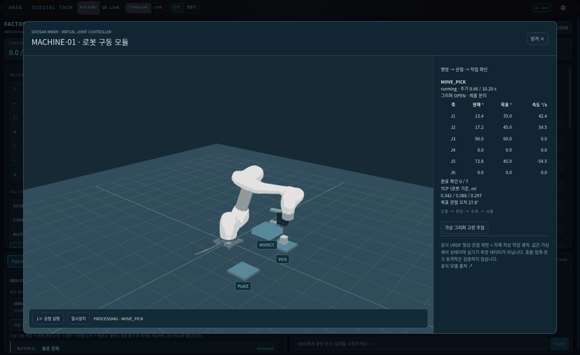
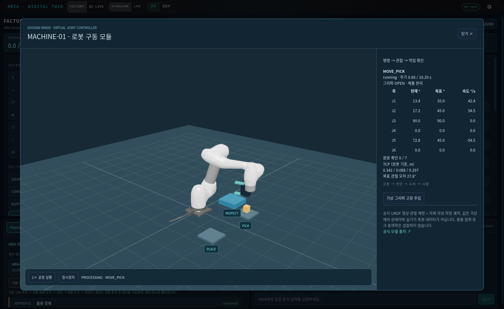
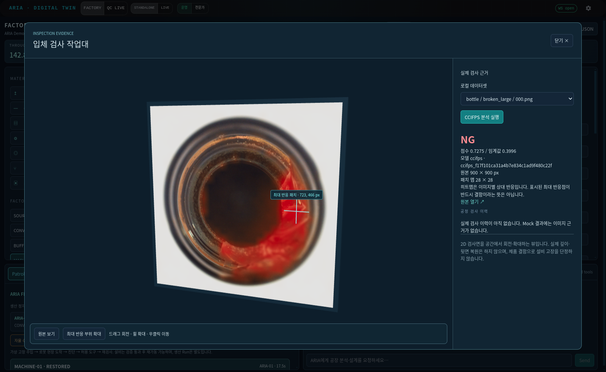
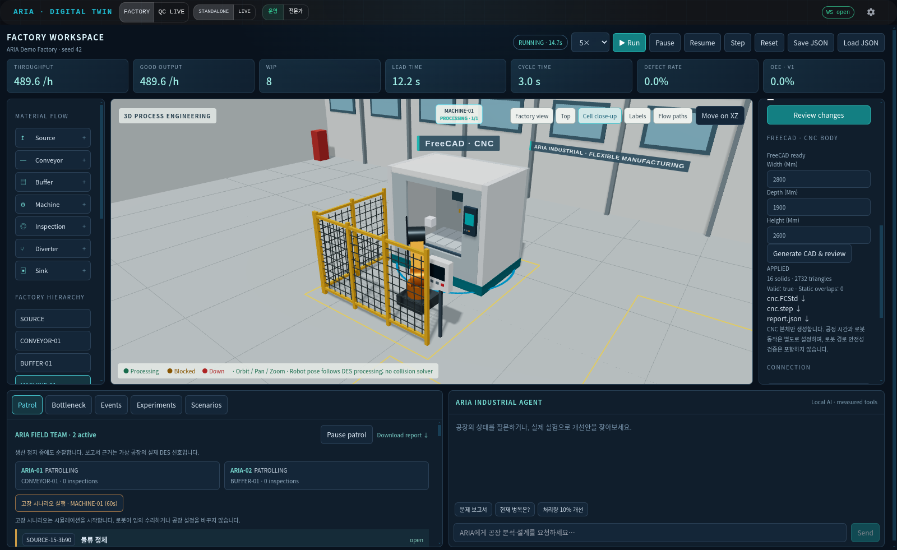
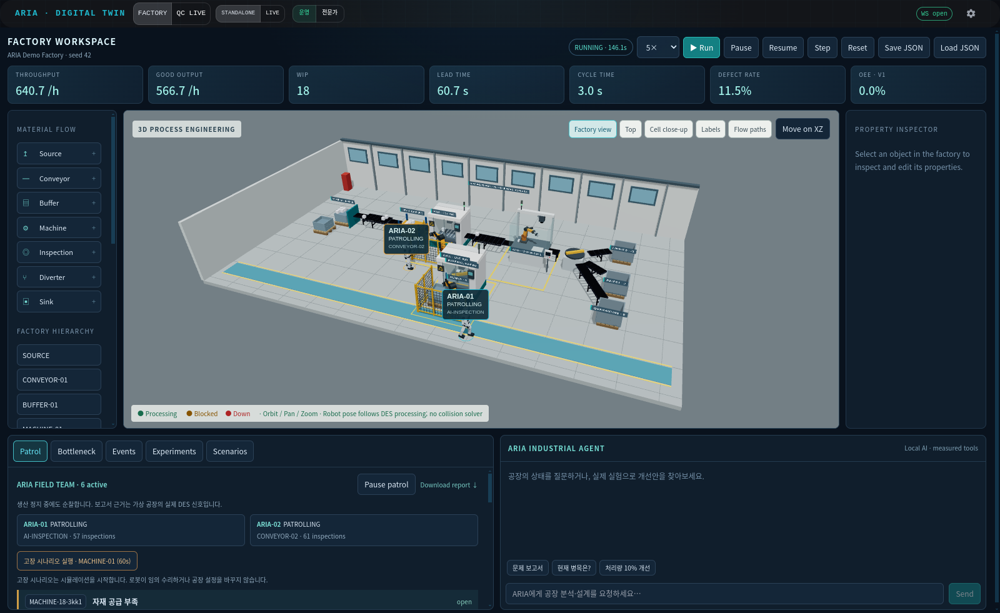
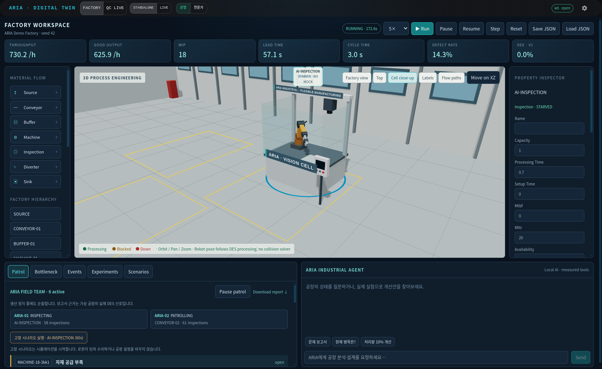
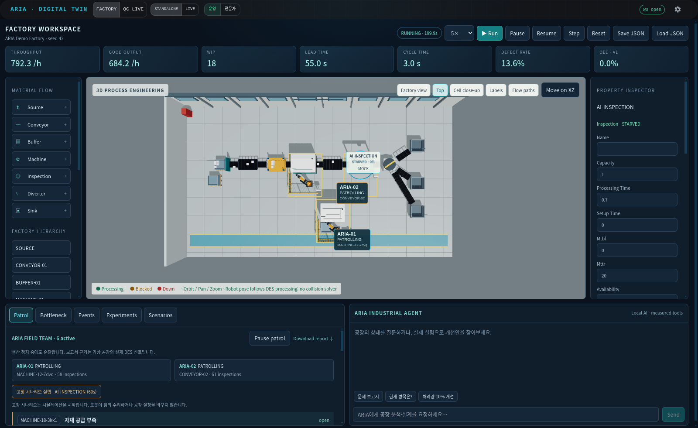
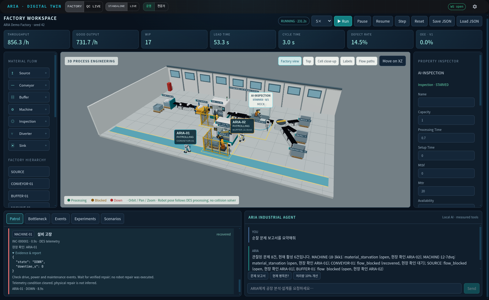
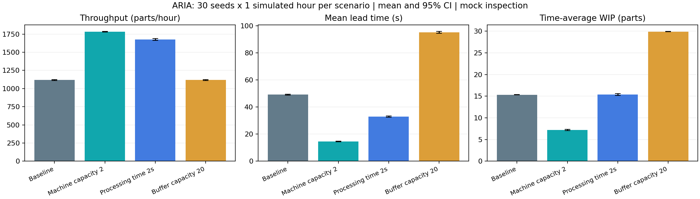

# ARIA — Autonomous Industrial Simulation & AI Agent



**M0609 관절 구동 → 고장 정지 → 현장 수리 → 검증 후 복구 → CCIFPS 검사 부위 확대**

실행한 브라우저의 주요 단계 캡처를 연결한 반복 미리보기입니다. 연속 시간 영상은 아니며, 검사 화면은 기존 CCIFPS 모델의 실제 추론 결과입니다.

**3D 공정 편집, 이산 사건 시뮬레이션(DES), CCIFPS 검사 연결, 휴머노이드 순찰 및 문제 보고를 통합한 산업 시뮬레이션 워크스페이스입니다.** 상단의 **Factory**에서 공정을 설계·실행하고, **QC Live**에서 기존 비전 검사 화면을 사용할 수 있습니다.

## 관절 제어·입체 검사·자율 수리 — 2026-09-18

**공식 M0609 모델 → 6축 가상 제어 → 집기·검사·놓기 완료 확인 → 고장 정지 → 순찰 로봇 진단·수리 → 시험 동작 → 공정 재개**를 연결했습니다.

- **로봇 구동 모듈**: 공식 두산 M0609 URDF와 10개 형상. 관절 현재/목표값, 속도, TCP, 그리퍼, 7단계 명령 완료 상태를 확인합니다.
- **입체 검사**: 현재 2D 이미지와 실제 CCIFPS 히트맵을 공간에서 회전·확대하고 최대 반응 픽셀을 확인합니다. 실제 깊이·뒷면을 추정하지 않습니다.
- **수리 하네스**: 현장 도착 → 센서 진단 → 허용된 가상 도구 → 재검사/손목 시험 → 인터록 해제. 실패·원인 불명 시 정지를 유지합니다.
- **검증**: 전체 테스트 **74개 통과**. 10개 seed 모두 고장 중 생산 중단 및 복구 후 재개. 복구 중앙값 21.0 제어초. 기존 모델로 실제 이미지 추론 NG 확인(0.7275 / 임계값 0.3996).





검사 원본: [MVTec AD](https://www.mvtec.com/research-teaching/datasets/mvtec-ad), bottle / broken_large / 000. 원본·히트맵을 포함한 해당 검사 캡처와 위 GIF는 [CC BY-NC-SA 4.0](https://creativecommons.org/licenses/by-nc-sa/4.0/) 조건으로 공유합니다. 변형: CCIFPS 히트맵·공간 뷰·UI 합성.

현재 MACHINE-01 선택 → **로봇 구동 모듈 → 1× 공정 실행**으로 볼 수 있습니다. **가상 그리퍼 고장 주입**은 별도의 MTTR 타이머 없이 하네스가 검증한 뒤 복구합니다. Factory의 **입체 검사 → CCIFPS 분석 실행**으로 이미지 근거를 확인합니다.

작업 궤적은 ARIA에서 작성했고, **실기기 운전 로그·두산 컨트롤러·충돌/토크 동역학을 재현한 것은 아닙니다**. [구현·재현·근거·제한 상세](docs/ROBOT_INSPECTION_HARNESS.md)

## 구현된 기능

| 영역 | 구현 내용 |
|---|---|
| 공정 설계 | Source / Conveyor / Buffer / Machine / Inspection / Diverter / Sink 배치, 연결, 속성 편집, JSON 저장·불러오기 |
| 시뮬레이션 | 이벤트 큐 기반 DES, 유한 버퍼, 처리·정체·자재 부족·고장 상태, 실행/정지/단계 진행/배속/초기화 |
| 공정 분석 | 처리량, 양품 생산량, WIP, 리드타임, 불량률, OEE V1, 자원별 병목 및 시나리오 비교 |
| 3D 설비 | CNC 하우징, 로봇팔, 안전 펜스, 검사 부스·카메라, 컨베이어, 팔레트·자재함, 공장 전체/평면/셀 확대 보기 |
| CCIFPS 연결 | 실제 CCIFPS 추론 어댑터와 검사 결과에 따른 분기. 데이터·모델 미준비 시 검사 누락 사유를 기록 |
| 순찰 로봇 | ARIA-01 / ARIA-02 휴머노이드가 설비 점유 영역을 피해 A* 경로로 이동. 생산 일시정지 중에도 순찰 지속 |
| 문제 보고 | DOWN, 물류 정체, 자재 부족, 검사 누락 감지. 근거·감지 시각·현장 확인 로봇·복구 상태 기록 및 Markdown 다운로드 |
| 공정 에이전트 | 병목 분석, 비교 실험, 검토 가능한 변경 제안. 공장 모델 변경은 사용자 승인 후 적용. 채팅/MCP에서 문제 보고 조회 |

기본 공정 데모와 순찰·보고는 API 키 없이 동작합니다. 순찰 보고는 **가상 공장의 실제 DES 신호를 사용하는 규칙 기반 기능**입니다. 보행 애니메이션과 평면 경로 계획을 제공하며, 물리 기반 보행·로봇 간 충돌 회피·실제 설비 진단·실물 수리는 구현하지 않았습니다. 가상 설비의 자율 수리는 위의 명시적 하네스에서 수행합니다. CCIFPS 실검사는 별도 데이터와 모델 준비가 필요합니다.

## Linux CAD · FreeCAD 연결 1단계

실제 FreeCAD 1.1.3 커널로 CNC 본체를 생성하고 ARIA에 적용합니다. **폭·깊이·높이 입력 → CAD 생성·정적 형상 검증 → 변경 검토·Apply → 3D 표시**를 연결했습니다. FCStd·STEP 원본과 검사 보고서를 내려받을 수 있습니다.

- MCP 도구: `get_cad_status`, `build_cnc_cad`, `get_cad_asset` — 실제 stdio 호출 검증 완료.
- CNC 본체: **16개 유효 솔리드 · 2,732개 삼각형 · 본체 부품 간 정적 겹침 0건**.
- 브라우저에서 폭 **2,800mm** 모델 생성·적용·Run/Pause 검증. 전체 테스트 **65개 통과**.
- 이번 단계는 CNC 본체 형상 연결이며, 로봇 경로 충돌·물리·실제 제조사 설계 검증은 포함하지 않습니다.



[설치·MCP 연결·검증 및 제한 사항](docs/FREECAD_INTEGRATION.md)

## 현재 워크스테이션에서 실행

Python 3.10과 Node 20을 사용하는, 이미 구성된 `aria` 환경 기준입니다. 새 환경에서는 Python 의존성(`requirements.txt`)과 프런트엔드 의존성(`frontend/package.json`)을 먼저 설치하세요.

```bash
cd /userHome/userhome4/sehoon/Aria-virual-industrial-main
conda activate aria
cd frontend
npm run build
cd ..
python -m uvicorn server.app:app --host 127.0.0.1 --port 8230
```

브라우저에서 <http://localhost:8230/>에 접속합니다.

1. **Factory → Run**으로 생산 흐름과 KPI를 확인합니다.
2. 설비를 선택하고 **Cell close-up**으로 로봇팔·검사 부스를 확대합니다.
3. **Patrol** 탭에서 두 로봇의 이동·관측 상태를 확인합니다.
4. **자율 수리 시나리오**는 선택한 설비를 가상 고장으로 정지시킵니다. 순찰 로봇이 도착하고 하네스의 수리·재검사가 통과해야 복구합니다. 생산 Run/Pause와 수리 진행은 구분됩니다.
5. 고장 감지와 로봇 도착 후 현장 확인을 구분해 확인하고, **문제 보고서** 또는 **Download report**로 기록을 조회합니다.

모델·시나리오는 `outputs/factory/factory.json`, 최근 200개 사건은 `outputs/factory/patrol_reports.json`에 저장합니다. `ARIA_FACTORY_STATE_DIR`로 저장 위치를 바꿀 수 있습니다. 런타임 데이터·모델·자격 증명은 Git에 포함하지 않습니다.

## 실제 구동 화면 — 2026-09-17

아래는 실행 중인 앱을 Chrome에서 직접 캡처한 화면입니다. 이번 캡처의 검사 셀은 MOCK 데모 모드이며 CCIFPS 실추론 성능 증거가 아닙니다. 첫 네 장은 생산 실행 중이며, 마지막 장은 누적 사건에 대한 보고 조회입니다. 보고서에는 명시적으로 실행한 가상 고장 시나리오의 기록도 포함됩니다.

### 1. 공장 전체 가동과 순찰 팀



### 2. CNC·로봇팔 작업 셀 확대


### 3. 비전 검사 셀 확대



### 4. 공정 배치 평면 보기



### 5. 순찰 사건과 에이전트 문제 보고



## 정량 실험 결과 (30개 시드 × 조건별 1시간)

실제 엔진 반복 실행 결과입니다. MOCK 검사·빈 공장 출발 조건이며 실제 공장 검증이나 상용 도구와의 비교 결과는 아닙니다.

| 조건 | 처리량/h | 리드타임 | 평균 WIP | 기준 대비 처리량 |
|---|---:|---:|---:|---:|
| Baseline | 1117.7 | 49.10s | 15.35 | +0.00% |
| Machine capacity 2 | 1783.4 | 14.54s | 7.22 | +59.61% |
| Processing time 2s | 1676.6 | 32.91s | 15.40 | +50.01% |
| Buffer capacity 20 | 1117.7 | 95.05s | 29.92 | +0.00% |



가상 고장 30회 중 30회 현장 확인, 모델 내 확인 시간 평균 4.12초. 실제 장비 고장 탐지 정확도를 뜻하지 않습니다.

규모 시험: 10·30개 컴포넌트는 10초 예산 내 1시간 완주(각 3/3), 100개는 0/3. 웹 화면은 소프트웨어 렌더링에서 보기별 평균 **9.5–11.7 FPS**였다.

**판단:** 이 모델 안에서 병목 개선안의 효과를 수치로 비교할 수 있음을 확인했습니다. 물리 기반 로봇 제어·실제 공장 보정·상용 도구 대비 우수성은 아직 검증하지 않았습니다. 소프트웨어 렌더링 성능도 별도 개선·검증이 필요합니다.

[95% 신뢰구간·3D 성능·한계·재현 방법 및 원자료](docs/FACTORY_BENCHMARK_REPORT.md)

## 검증 및 상세 문서

- Python 전체 테스트 **65개 통과**, 프런트엔드 production build 통과(대형 번들 경고 존재).
- 실제 브라우저에서 **고장 주입 → ARIA-01 현장 확인 → recovered 기록** 검증. 해당 검증의 브라우저 예외·HTTP 오류 0건.
- [공정 시뮬레이션 구현·API·실험 보고서](docs/INDUSTRIAL_V1_REPORT.md)
- [순찰·문제 보고 구현 및 검증](docs/PATROL_AGENT_REPORT.md)
- [공정 에이전트 명세](docs/specs/INDUSTRIAL_SIM_AGENT_V1.md)
- [작업 진행 기록](docs/CODEX_PROGRESS.md)

주요 코드: `aria/simulation/des/`(엔진·검사·순찰·에이전트), `server/routers/factory.py`(API), `frontend/src/hmi/factory/`(3D/UI), `aria/mcp/servers/factory_mcp.py`(MCP).
