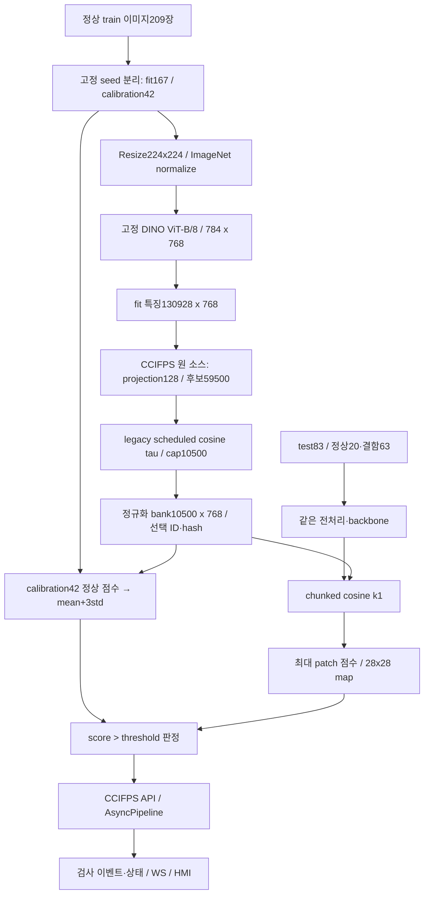

# ARIA × CCIFPS: 실제 feature selection 연결과 첫 실측 보고서

작성일: 2026-09-17 · 실행 ID: `improvement_20260916_01` · 저장소 기준 HEAD: `5c717bb56e4c909e48a317c1afb2bbb6a14ea9fa`

## 1. 목표와 현재 완료 범위

사용자의 목표는 **CCIFPS-AutoML의 이상 탐지 feature selection을 사용하는 ARIA 디지털 트윈**이다. 단순 화면 개선이나 DINO 랜덤 bank 최적화가 최종 목표가 아니다.

이번에는 원본 선택기를 실제로 연결하고, 클래스별 bank를 원본과 분리해 생성하며, API → 검출기 → 비동기 검사 라인 → HMI 모델 선택 경로를 구현했다. 실제 bottle 한 클래스의 정상 train/calibration 분리 및 test 전체83장으로 첫 비교를 완료했다.

**CCIFPS 논문 전체 파이프라인을 그대로 이식한 결과는 아니다.** 이번 연결은 DINO ViT-B/8 D768 특징에 실제 CCIFPS legacy hybrid 선택기를 적용한 새 조합이다. 기존 WR50 L2+3/D1024나 paper fixed-tau full-pass→farthest-K/D1 최종 결과를 대신하지 않는다. seed0 단일 파일럿이므로 15클래스 또는 3seed 우위로 일반화하지 않는다.

## 2. 기존 ARIA를 분석해 확인한 문제

|항목|기존 실제 동작|이번 조치|
|---|---|---|
|이상 탐지 선택기|`build_bank_from_features`가 정상 특징 중 RNG seed0로4,000개 랜덤 선택|원 CCIFPS `ClassConditionedIrredundantSampler` 격리 호출 추가|
|backbone|DINO ViT-B/8 마지막 patch token D768|유지하고 명세·가중치 hash 동결|
|검색|정규화 특징 cosine max, dense N×M 행렬|동일 수식의 chunked exact max 공유 함수|
|중복 구현|scorer와 detector가 cosine 수식을 각각 구현|공통 `cosine_patch_scores` 호출|
|API|async route에서 동기 추론 직접 실행|threadpool 위임; 일반 분석 API 호출 간 초기화 직렬화|
|파일명|초 단위 timestamp라 동시 upload 충돌 가능|UUID 파일명|
|입력 경로|문자열 startswith로 디렉토리 검사|resolve 후 실제 부모 경로 비교|
|CCIFPS 결과 출처|실제 source/선택 index 연결 없음|원 source snapshot, projection, 선택 ID, train grid provenance|
|모델 소비|기존 bank 경로만 읽음|CCIFPS bundle 완료 상태·bank hash·특징 규약 검사|
|HMI 기본|combined 모드|CCIFPS 모델을 명시적으로 고른 뒤 단일 가동|

기존 bank `bottle/cable/screw.npy`는 각각4,000×768 float32, **12,288,000 bytes**. 덮어쓰지 않았다. `data`는 `/userHome/userhome4/sehoon/CCIFPS-AutoML/data`를 가리키는 기존 symlink이므로 제조 데이터를 중복 다운로드하지 않았다. 가중치도 기존 Hugging Face 캐시를 strict=True로 읽었고 온라인 다운로드를 하지 않았다.

## 3. 실제 파이프라인



DINO 출력은224/8=28 grid의784 patch, D768이다. 원본224×224를 그대로 resize하는 경로이며 CCIFPS 연구의 resize256→crop224와 다르다. CNN WR50의 계층 결합도 아니다. grayscale mask는 본 파일럿에서 nearest resize224로 GT를 대응시켰다.

bank는 학습된 centroid가 아니라 선택된 실제 fit 특징이다. `selected_indices`의 `i//784`가 fit 이미지 위치이고, `i%784`를28열로 나누어 grid를 복원한다. `memory_provenance.csv`에 원 이미지 상대경로와 row/col을 저장했다. 검출기의 검색 bank에는 기존 ARIA 규약에 맞게 L2 정규화를 적용한다.

## 4. 사용한 CCIFPS 구현의 정확한 정체

- 원 경로: `/userHome/userhome4/sehoon/CCIFPS-AutoML/src/patchcore/sampler.py`
- 함수/클래스: `ClassConditionedIrredundantSampler.run` → `_hybrid_sampling`.
- 원 selector SHA-256: `3592042065de811800e989429543a9358eb2d679f6bea7276ad974218b17f66a`.
- 격리 import: `/userHome/userhome4/sehoon/Aria-virual-industrial-main/banks/ccifps/ccifps_f17f101ca31a4b7e834c1ad9f480c22f/source_snapshot/patchcore/sampler.py`.
- 클래스 설정 출처: CCIFPS recovery `effective_config.csv`의 bottle 행. budget70,000, ratio.85, τ.01, greedy, projection128.
- 실제 P=59,500, 실제 K=10,500; 원 소스의 `budget−len(stage1)` 결합과 scheduled τ를 유지했다.
- 이 경로는 고정τ 보장 branch가 아니다. 후보확대B나 paper full-pass policy로 재명명하지 않는다.
- selector가 반환하는 가중치는 저장하되 **inference density에는 적용하지 않았다**. CCIFPS feature selection의 연결을 검증하는 범위다.
- 선택 결과가 `fit_features[selected_indices]`와 배열 동일함을 assert했다.
- 80×768 합성 입력·3seed에서 observer 유무의 bank/weights/Python·NumPy·torch RNG 일치를 검사했다. 전체 데이터에서 두 번 선택한 검사는 아니다.

bundle: `ccifps_f17f101ca31a4b7e834c1ad9f480c22f`

bank payload: **32,256,000 bytes**, 선택 시간 **36.925s**, 캐시 재사용 bundle 생성 wall-clock **41.667s**. feature 추출 시간은 앞선 파일럿에서 별도 측정했다. 선택기를 적용했다고 bank가 항상 더 작아지는 것은 아니다.

## 5. 비교 조건과 누출 방지

|항목|설정|
|---|---|
|split seed|20260916|
|selector seed|0|
|정상 train|209장 중 fit167 / calibration42, 서로 겹치지 않음|
|test|83장 전부: 정상20 / 결함63|
|threshold|calibration 정상 이미지 score의 mean+3×population SD|
|판정|strict `score > threshold` → NG; 기존 경계 유지|
|test threshold 최적화|하지 않음|
|검색|normalized cosine k1, inference density off|
|Pixel map 평가|28→224 bilinear, smoothing 없음, 정상 test mask0 포함 pooled AP|
|공통 특징|같은 추출 cache와 weight bytes|
|실험 범위|랜덤4,000 / CCIFPS / 랜덤동일K, 각1구성|

마지막 k-NN 최대거리로 만든 **이미지 점수**와 Pixel AP를 구분한다. 이번 image F1은 held-out normal train threshold를 사용한다. 이전 연구의 test-oracle Pixel F1과 같은 지표가 아니다. calibration42장으로 독립 현장 운영 성능까지 보장하지 않는다.

## 6. 전체 방법·동일-K 결과

| 방법 | K | bank bytes | threshold | Image AP | Image F1 | FP 이미지 | FN 이미지 | Pixel AP |
|---|---|---|---|---|---|---|---|---|
| random4000 | 4000 | 12288000 | 0.508414 | 1.000000 | 0.975610 | 0 | 3 | 0.868211 |
| ccifps | 10500 | 32256000 | 0.399646 | 1.000000 | 0.992000 | 0 | 1 | 0.867987 |
| random_same_K | 10500 | 32256000 | 0.486746 | 1.000000 | 0.967213 | 0 | 4 | 0.868827 |

- CCIFPS vs 랜덤4,000: 이미지 FN3→1, FP0→0. bank는12,288,000→32,256,000 bytes로 **2.625배** 증가했다. 이를 메모리 절감 성공이라고 부르지 않는다.
- 동일K10,500: 랜덤 FN4 vs CCIFPS FN1, FP는 둘 다0. 각 방법의 train-calibrated threshold가 달라 threshold 영향까지 포함한 결과다.
- Pixel AP는 CCIFPS0.867987 vs 랜덤동일K0.868827, **−0.083919%p**. 위치 성능은 약화됐다. 유리한 이미지 결과만 골라 결론내리지 않는다.
- Image AP/AUROC는 세 구성 모두1.0. 한 클래스의 분리도가 높은 결과이며 데이터 누출을 새로 입증하거나 전체 클래스 완벽 탐지를 뜻하지 않는다.
- Pixel AP를 보고τ/K/ratio를 다시 고르지 않았다. 단일 seed의 미탐 개선을 통계적 유의성이나 selector만의 단독 인과로 주장하지 않는다.

raw source 특징 cache703,266,816 bytes(292×784×768×4), GT·예측 map·이미지ID·calibration scores를 별도 저장했다. 원본 연구0.6160 등과 수치를 결합하지 않는다.

## 7. 경량화: 무엇을 줄였고 무엇이 느려졌나

| 항목 | dense 기준 | chunked 변경 |
|---|---|---|
| 동일 bottle bank similarity 임시행렬 bytes | 12544000 | 1048576 |
| 검색 p50 ms | 9.681 | 14.052 |
| 검색 p95 ms | 11.724 | 16.636 |
| 최대 patch 점수 차이 | 기준 | 0.0 |
| 83장 판정 변경 | 기준 | 0 |

similarity 작업공간 상한은 **91.641%** 감소했다. 이는 전체 프로세스 RSS/VRAM 실측 감소율이 아니다. 입력·bank·BLAS workspace·finite 검사 배열 등은 따로 존재한다.

검색 중앙 지연은 **45.15% 증가**했다. 작은 GEMM 반복의 비용을 포함한다. 추론 속도 우위를 얻은 변경이라고 쓰지 않는다. 현재 구현은 한 번에 만드는 거리행렬 크기를 제한하는 선택이다. feature dtype과 차원, 모델 가중치·수식은 줄이지 않았다. INT8·FP16·증류·ONNX/TensorRT 경량화는 실행하지 않았다.

측정은 동기 NumPy CPU 검색, BLAS4thread, 기존 특징 고정, 두 방식의 측정 순서를 이미지별 교대로 사용했다. GPU feature 추출과 검색을 혼합해 GPU 추론 속도라고 부르지 않는다. 전체292장 feature 추출은 **23.932s**, 최초 파일럿 wall-clock **34.592s**. 캐시 저장·평가 포함 범위가 다른 timer끼리 단순 비교하지 않는다.

## 8. API와 실제 단일 라인 검증

|API|역할|
|---|---|
|POST /api/ccifps/train|class 정상train→격리 worker→CCIFPS bundle; 시작/종료 training 이벤트|
|GET /api/ccifps/runs|학습 bundle 목록·상태·K·threshold|
|GET /api/ccifps/runs/{run_id}|manifest와 성공/실패 상태|
|POST /api/ccifps/analyze|완료·hash·D768 규약 검사 후 실제 image 분석|
|POST /api/inspector/start|mode=ccifps, category, ccifps_run_id로 비동기 단일 라인 검사|
|WS /ws/chat|기존 검사 상태와 CCIFPS 학습 이벤트; 검사 이벤트에 model_run_id/selector 추가|

훈련 API는 원 source를 run 내부 snapshot으로 복사하고 subprocess에서 import한다. `ARIA_CCIFPS_SOURCE`로 원 저장소 경로 지정 가능. `ARIA_CCIFPS_GPU_UUID`는 UUID1개만 지정한다. GPU 미지정이면 CPU이며 자동으로 다른 사용자의 GPU를 점유하지 않는다. 동일GPU worker lock을 두고 중복 실행은 실패 상태로 남긴다. 원 bank를 대체하는 activate 동작은 없고 bundle을 명시적으로 고른다.

실제 `/api/ccifps/analyze` 입력 `bottle/test/broken_large/000.png`: score **0.727503**, threshold **0.399646**, 판정 **NG**. cold API 전체 **4.385s**이며 모델 로딩 포함이므로 warm 검색 ms와 비교하지 않는다.

실제 CCIFPS 단일 라인5장/2Hz:

| 지표 | 관측값 |
|---|---|
| n_trigger | 5 |
| n_ok | 3 |
| n_ng | 2 |
| n_skipped | 0 |
| n_error | 0 |
| drop_count | 0 |
| ack_max_ms | 2.216 |
| infer_latency_p95_ms | 121.27 |
| queue_depth | 0 |

5장은 통합 경로 smoke이며 처리량/정확도의 정밀 benchmark가 아니다. 정상·결함이 섞인 정해진 순서에서3 OK/2 NG가 나왔다. camera는 이미지 경로를 주는 MockDriver이고 실제 추론을 수행했다. 물리 카메라·PLC·로봇 실행이 아니다.

E2E 서버는 localhost 임시 포트로 띄우고 lifespan off로 별도 PdM 서비스를 시작하지 않았다. 실제API 호출 뒤 테스트 프로세스만 종료했다. 외부 MQTT/OPC UA broker와 Telegram 전송은 실행하지 않았다.

## 9. 실패→조치→검증 기록

|실패/불일치|조치|결과/한계|
|---|---|---|
|원본 문서의 CCIFPS와 실제 랜덤 bank 불일치|원 선택기를 별도 namespace/process로 연결|selector source hash·실제 선택ID 기록|
|dense 행렬 메모리 증가|exact chunk max|점수차0/판정변화0, 지연 증가도 기록|
|API event loop 차단|threadpool + 입력·파일명 검사|느린 가짜 추론 중 heartbeat 응답 회귀 통과|
|프론트 빌드 root를 잘못 지정|frontend 작업 디렉토리에서 재빌드|실패 로그와 성공 로그 모두 보존|
|warmup 치환이 레인 thread에 await를 삽입|단일 async route만 threadpool, 레인 thread는 원 동기 호출 복원|최초 E2E SyntaxError 보존; 실제5장 재검증 성공|
|라우트 introspection 테스트가 내부 .path 가정|공개 OpenAPI paths를 검사|최종 테스트30개 통과|
|CDP가 extension target 연결|page target 구분 및 timeout 추가|진단 로그 보존; 브라우저 상태는 별도 절에 기록|

원본8개 테스트 → 최종30개. source 선택 관측 회귀3seed는 별도 JSON. 기존 pynvml/FastAPI deprecation 경고는 남아 있다. 테스트 통과가 모든 현장 조건의 검증을 대신하지 않는다.

## 10. 디지털 트윈 의미와 남은 한계

FactoryLine은 실제 검사 이벤트와 GPU telemetry를 받아 결정론적으로 상태를 바꾼다. thermal≥84°C 우선 감속 .35배, hot은 .7배, training/QA/RUNNING/IDLE 순서, tact EMA α=.3, 처리량60s window, 기본 결함률 목표30%다. **GPU 온도는 물리 생산설비의 실제 온도가 아니며** 화면의 고장/RUL 추정은 실제 설비 고장 데이터로 보정됐다는 근거가 없다.

현재 연결의 한계:

1. bottle seed0만 실측. screw/capsule 및 Texture 3seed 반복과 WR50 논문 특징 이식은 아직 실행하지 않았다.
2. CCIFPS multi-lane은 클래스별 bundle 연결을 검증하지 않아 API/UI에서 명시적으로 막았다. 다른 방식으로 조용히 fallback하지 않는다.
3. paper fixedτ/full-pass/D1/multi-k 파이프라인이 아니라 **원 legacy feature selector의 DINO 적용**이다.
4. single-frame API는 detector 생성과 가중치 확인·로딩 비용이 있다. inspector는 생성한 detector를 재사용한다. API model cache와 hot-swap은 별도 검증이 필요하다.
5. training API는 별도프로세스 실행을 제공하지만 이번 실제모델 검증은 같은 build 함수를 호출한 저장-feature 파일럿이다. `/train` 전체 재추출 작업을 추가로 반복해 성공했다고 주장하지 않는다.
6. 동시 API 요청·대량 lane·실측기기·외부 broker의 장시간 부하 시험은 미실행이다.
7. repository의 별도 `ThresholdCalibrator`에 남은 최소5.0/기본15.0 설정과 cosine 점수 scale은 별도 경로다. 이번 CCIFPS bundle은 정상 holdout threshold를 직접 사용하며 그 값을 사용하지 않는다. 모든 legacy 경로를 통합 교정한 것은 아니다.
8. 전체 제품 구현을 ‘완벽하게 완료’했다고 선언할 근거는 없다. 이번 완료 범위는 원 알고리즘 연결과 첫 통제 비교·API 단일라인 검증이다.

### 10.1 브라우저 검증과 미해결 렌더링

실제 Chrome headless에서 HTTP API·WebSocket 연결과 CCIFPS 모델 선택 UI를 확인했다. 다만 3D 영역은 비어 있어 공장 씬 렌더링 성공으로 처리하지 않았다. CDP 진단은 extension target을 잡은 첫 오류와 페이지 탐색/캡처 timeout을 각각 기록했다.

외부 폰트 preload 의존성을 의심해 재배포 허용 로컬 폰트를 적용한 후보를 만들었으나 같은 빈 화면이 남았다. 따라서 **폰트가 원인이라고 확정하지 않았고 해당 변경을 채택하지 않았다**. 원 package/main 파일로 복원했으며 후보와 라이선스는 `unadopted_offline_font/`에 보존했다. 패키지 설치는 없었다.

- 첫 화면: [hmi_ccifps.png](../outputs/improvement_20260916_01/hmi_ccifps.png)
- 실패한 폰트 후보 화면: [hmi_ccifps_offlinefont.png](../outputs/improvement_20260916_01/hmi_ccifps_offlinefont.png)

headless 렌더링 제약과 앱 내부 3D 로딩 문제를 아직 분리하지 못했다. API 성공으로 이를 덮지 않는다. 실제 물리 디지털 트윈 완성이나 현장 FAT 완료를 주장하지 않는다.

## 11. 실행 방법

```bash
cd /userHome/userhome4/sehoon/Aria-virual-industrial-main
# 실제 사용 직전 GPU 가용량을 확인하고 UUID 한 개를 지정한다.
export CUDA_VISIBLE_DEVICES=<사용가능한-GPU-UUID>
export ARIA_CCIFPS_GPU_UUID=$CUDA_VISIBLE_DEVICES
export ARIA_CCIFPS_SOURCE=/userHome/userhome4/sehoon/CCIFPS-AutoML
export ARIA_FRONTEND_DIST=$PWD/outputs/improvement_20260916_01/frontend_dist
/userHome/userhome4/sehoon/miniconda3/envs/aria/bin/python -m uvicorn server.app:app --host 127.0.0.1 --port 8200
```

기존 `frontend/dist`는 보존했다. 검증한 새 UI는 `outputs/improvement_20260916_01/frontend_dist`에 있다. 위 ARIA_FRONTEND_DIST를 지정하면 기존 dist를 덮어쓰지 않고 검증된 새 UI를 사용한다. 이번 확인용 서버도 별도 dist를 직접 지정했다.

```json
POST /api/inspector/start
{"mode":"ccifps","category":"bottle","ccifps_run_id":"ccifps_f17f101ca31a4b7e834c1ad9f480c22f","line_hz":2,"max_parts":5}
```

HMI에서 CCIFPS 검사 모델을 선택하면 calibration threshold를 bundle에서 읽는다. 기존 ActionBar의 tau0.5 payload는 ccifps mode에서 사용하지 않는다. 선택 thresholdτ=.01과 판정 threshold≈.399646은 서로 다른 개념이다.

## 12. 근거 파일

- [ccifps_comparison.csv](</userHome/userhome4/sehoon/Aria-virual-industrial-main/outputs/improvement_20260916_01/ccifps_comparison.csv>): 세 구성의 실제 K/bytes/AP/FN/FP/threshold.
- [manifest.json](</userHome/userhome4/sehoon/Aria-virual-industrial-main/banks/ccifps/ccifps_f17f101ca31a4b7e834c1ad9f480c22f/manifest.json>): 원 selector·가중치·입력 hash·분할·시간.
- [memory_provenance.csv](</userHome/userhome4/sehoon/Aria-virual-industrial-main/banks/ccifps/ccifps_f17f101ca31a4b7e834c1ad9f480c22f/memory_provenance.csv>): 선택 특징→원 이미지/grid.
- [per_image.csv](</userHome/userhome4/sehoon/Aria-virual-industrial-main/outputs/improvement_20260916_01/per_image.csv>): 83장 dense/chunked 점수·지연.
- [pilot_results.json](</userHome/userhome4/sehoon/Aria-virual-industrial-main/outputs/improvement_20260916_01/pilot_results.json>): 메모리 작업공간·수치 일치·시간.
- [e2e_results.json](</userHome/userhome4/sehoon/Aria-virual-industrial-main/outputs/improvement_20260916_01/e2e_results.json>): 실제 API 응답과5장 pipeline 상태.
- [pytest_final.log](</userHome/userhome4/sehoon/Aria-virual-industrial-main/outputs/improvement_20260916_01/pytest_final.log>): 최종 회귀 결과.
- [observer_regression.json](</userHome/userhome4/sehoon/Aria-virual-industrial-main/outputs/improvement_20260916_01/observer_regression.json>): 선택 observer/RNG 회귀.
- `source_before/`: 수정 전 파일 보존. CCIFPS 원 저장소 자체는 변경하지 않았다.

