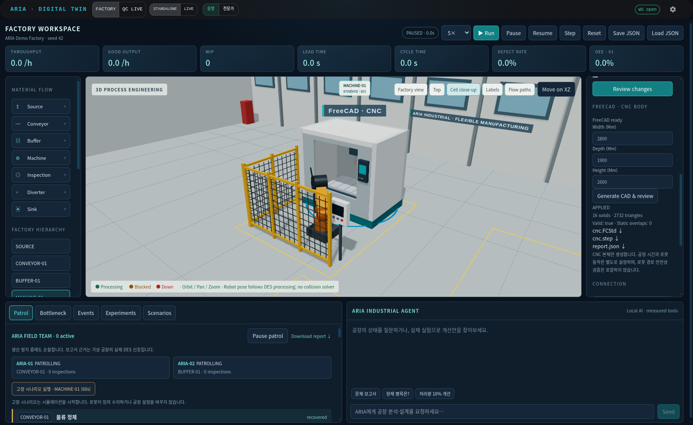

# FreeCAD–ARIA 연결 1단계 — 2026-09-18

Linux 워크스테이션에 공식 FreeCAD 1.1.3을 설치하고, CNC 본체를 치수로 생성해 ARIA 설비에 연결했다. FreeCAD GUI를 띄우지 않고 실제 CAD 커널을 실행한다. 로봇팔·펜스는 기존 ARIA 시각 모델이며 이번 CAD 생성 범위는 CNC 본체이다.

## 구성

`MCP client → aria-freecad MCP → ARIA CAD API → FreeCAD Python worker → FCStd / STEP / mesh / report → 변경 제안 → UI Apply → 3D 표시`

- FreeCAD: 공식 Linux x86_64 AppImage 1.1.3, SHA256 검증 후 프로젝트 전용 `outputs/cad-runtime/`에 추출. 시스템 패키지·기존 conda 환경은 변경하지 않았다.
- 고정된 Python 생성기만 실행한다. 요청으로 임의 Python 코드를 받지 않는다.
- 입력: 폭 1800–3000 mm, 깊이 1400–2100 mm, 높이 2200–3000 mm. 현재 CNC 작업 셀의 제한된 범위이며 임의 공장 설비 CAD 가져오기는 아직 제공하지 않는다.
- CAD 좌표는 mm/Z-up, ARIA 메시는 m/Y-up. 변환은 `(x, y, z) → (x, z, -y) / 1000`이다.
- 결과는 치수·생성기 기반 ID로 캐시한다. 생성은 한 번에 한 작업, 최대 60초이며 실패 시 부분 산출물을 최종 자산으로 노출하지 않는다.
- 실제 BRep 솔리드 유효성과 본체 내부 부품 쌍의 정적 겹침 체적을 검사한다. 겹침이 있으면 API에서 모델 연결 제안을 차단한다.
- 생성 자체는 공장을 수정하지 않는다. 기존 검토/승인 절차에서 `cad_asset`을 적용한다. 적용은 기존 정책대로 생산 시뮬레이션을 초기화한다.

## 설치·실행 재현

프로젝트 루트에서 실행한다. 설치 스크립트는 약 821 MB 공식 패키지를 다운로드하고 추출하므로 추가 디스크 공간이 필요하다.

```bash
conda activate aria
python tools/install_freecad.py
cd frontend
npm run build
cd ..
python -m uvicorn server.app:app --host 127.0.0.1 --port 8230
```

공식 릴리스: https://github.com/FreeCAD/FreeCAD/releases/tag/1.1.3

SHA256: `3a853eb69ee595f779f2255dbf80a765926981d8ff68903cefee4dfb03a8f5ef`

다른 위치의 동일 런타임은 `ARIA_FREECAD_RUNTIME`을 추출한 `squashfs-root` 경로로 지정한다. 설치 파일과 생성 자산은 Git에서 제외되며, 새 체크아웃에서는 설치 및 CAD 생성이 필요하다.

## 화면에서 사용

1. Factory에서 `MACHINE-01` 선택 → `Cell close-up`.
2. 오른쪽 속성 창을 내려 `FREECAD · CNC BODY` 확인.
3. width / depth / height를 mm로 입력 → `Generate CAD & review`.
4. 변경 제안을 확인하고 `Apply`하면 같은 위치의 CNC 본체가 실제 FreeCAD 메시로 교체된다.
5. `cnc.FCStd`, `cnc.step`, `report.json`을 내려받을 수 있다.

깊이 입력값은 하우징 깊이이다. 콘솔·버튼 돌출부를 포함한 전체 외곽 깊이는 보고서 `envelope_mm.depth`로 별도 기록한다. FCStd에는 치수와 생성된 솔리드가 저장된다. FCStd의 치수 속성을 수동 변경한다고 형상이 자동 재계산되는 피처 트리는 아직 구현하지 않았다. 치수 변경은 API/UI를 통해 재생성한다.

## MCP

`mcp_config.json`에 `cad` 서버를 추가했다. 클라이언트가 이 설정을 다시 로드해야 도구가 노출된다. 이 설정은 ARIA 프로젝트용이며 사용 중인 모든 ChatGPT 클라이언트에 자동 설치되는 것은 아니다.

| 도구 | 기능 |
|---|---|
| `get_cad_status` | FreeCAD 실행 파일 존재 확인 |
| `build_cnc_cad(component, width_mm, depth_mm, height_mm)` | 실제 CAD 생성·검증, 적용 제안 반환 |
| `get_cad_asset(asset_id)` | 검증 보고서와 다운로드 URL 조회 |

직접 서버 실행: `python aria/mcp/servers/cad_mcp.py`. API 기본 주소는 `http://127.0.0.1:8230`이며 `ARIA_FACTORY_API`로 바꾼다. MCP는 모델 승인 기능을 노출하지 않는다.

## 검증

- 전체 테스트 **65개 통과**, 프런트엔드 production build 통과. 기존 대형 JS 번들 및 라이브러리 폐기 예정 경고는 남아 있다.
- 실제 FreeCAD로 폭 1800 / 2500 / 3000 mm 모델 생성, 유효 솔리드·정적 겹침·좌표 변환·STEP/FCStd 내보내기·캐시 재사용 확인.
- 생성된 2800 mm FCStd와 STEP를 FreeCAD에서 다시 열어 각각 유효 솔리드 16개와 STEP 외곽 폭 2800 mm를 확인했다.
- 기본 CNC: **16개 유효 솔리드, 2732개 삼각형, 본체 부품 간 정적 겹침 0건**.
- API 통합 검증: 잘못된 치수·설비·자산 경로 거부, 승인 전 모델 불변, 승인 후 CAD 참조 연결, 적용 전후 동일 조건의 DES 지표 일치.
- 실제 MCP stdio 세션: 도구 3개 검색, 2600 mm CNC 생성, 결과 조회 및 pending 제안 반환 확인.
- 실제 브라우저: 폭 2800 mm 입력 → 생성 → 검토 → Apply → 3D 표시 → Run/Pause 검증. 캡처와 결과를 아래에 첨부한다.



## 한계

이번 단계는 실치수 CAD 형상과 공정 객체를 연결하는 기능이다. 실제 제조사 CNC 설계가 아니라 자체 생성한 개념 모델이다. 정적 겹침 0건은 로봇팔 작업 경로, 작업자 안전, 조립 가능성, 접촉·하중·구조 강도를 보장하지 않는다. CNC 본체 메시 자체는 정적이며 기존 로봇팔 애니메이션은 DES 상태를 표현한다. CAD 크기를 바꿔도 처리시간·생산능력은 자동 보정되지 않는다. CAD–공정 ID 연결 및 형상 검증을 완료한 첫 단계로, Gazebo 물리·센서 연결과 일반 CAD 파일 가져오기는 후속 범위다.
