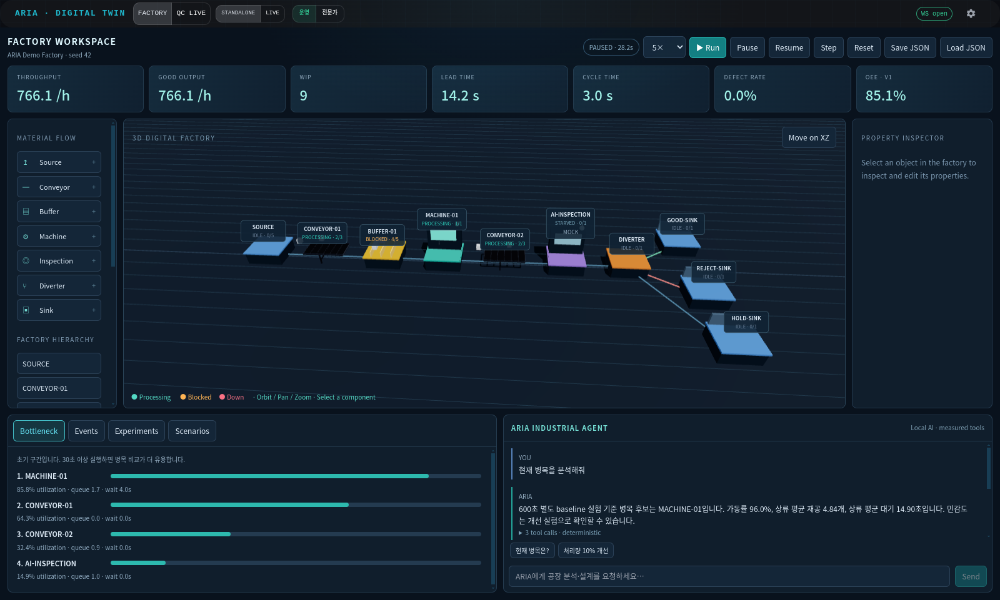

# ARIA Virtual Industrial V1 — Implementation & Validation

Date: 2026-09-17. Repository: `/userHome/userhome4/sehoon/Aria-virual-industrial-main`.

## Implemented

Factory workspace added inside existing ARIA. Original QC Live workspace, inspection pipeline, GPU telemetry, FactoryLine and TwinState remain available. A validated model now drives DES and 3D presentation. Factory editing, controls, measured metrics, bottlenecks, scenarios, agent experiments and human-approved changes are functional.

## Architecture

Natural language → bounded IndustrialAgent → validated FactoryService tools → heap-based DES → shared `/ws/chat` → Zustand raw fanout → R3F renderer. MCP is a thin client of the same service. Simulation owns truth; animation only interpolates real part locations. Simulated inspection never feeds the existing live-inspection KPI counters.

## Important Files

- `aria/simulation/des/model.py`: contracts and default factory.
- `engine.py`: deterministic events, transfer/backpressure, fault interruption, metrics.
- `inspection.py`: existing PatchCore/CCIFPS/Combined detector bridge.
- `service.py`: serialized controls, scenarios, experiments, persistence and approvals.
- `agent.py`: offline industrial commands and optional configured local Ollama planning.
- `server/routers/factory.py`, `server/app.py`: APIs, shared WS events, runtime loop.
- `aria/mcp/servers/factory_mcp.py`, `mcp_config.json`: MCP bridge.
- `frontend/src/hmi/factory/`: workspace, scene, store and style; `AppShell.jsx` adds Factory/QC Live selection.
- `tests/test_industrial_des.py`, `tests/test_factory_api.py`: 23 new test cases.
- `tools/verify_factory_browser.py`: destructive-to-test-factory-only browser acceptance harness, explicitly gated by an environment flag.

## API

Prefix `/api/factory`:

| Method | Routes | Behavior |
|---|---|---|
| GET / PUT | `/model` | Read / propose model replacement |
| GET / POST | `/components` | List / propose addition |
| PATCH / DELETE | `/components/{id}` | Propose edit / deletion |
| POST | `/connect` | Propose directed routing connection |
| POST | `/run`, `/pause`, `/resume`, `/step`, `/reset` | Simulation controls |
| GET | `/snapshot`, `/metrics`, `/bottlenecks` | State and measured analysis |
| GET / POST | `/scenarios` | List / save snapshots |
| POST | `/scenarios/{id}/run`, `/experiments` | Headless simulations / parameter sweep |
| GET / POST | `/tools`, `/tools/{name}` | Tool discovery / execution |
| POST | `/proposals/{id}/apply`, `/proposals/{id}/reject` | Explicit human decision |
| POST | `/agent` | `{ "message": "현재 병목을 분석해줘" }` |

Incoming WS `{ "type": "factory_chat", "message": "..." }` is also supported. Outgoing `simulation_state` includes bounded event history, part moves, metrics and model revision. Agent plan/action/observation/result and experiment progress use the same socket.

## Simulation Model

Source → Conveyor → Buffer → Machine → Conveyor → Inspection → Diverter → OK/NG/SKIPPED sinks. Seed42; arrival2s; machine3s, MTBF300s, MTTR20s; buffer5; inspection0.7s. FIFO/LIFO queues, finite capacities, setup, availability/failures and maintenance. DAG validation; disconnected nodes allowed for editing and reported by validation warnings. Units: seconds, metres, radians.

## Agent Tools

Model/state/component queries, validated component creation/edit/deletion/connections, model validation, start/pause/resume/step/reset, metrics/bottleneck analysis, scenario create/list/run/compare, parameter sweep, propose/apply/reject/undo. Model changes are always proposals. The ordinary tool endpoint and MCP cannot call human-only apply/reject. Proposals contain before/after model and revision; stale/double approvals are rejected. Apply resets and persists, undo produces a new proposal.

Supported offline examples:

- `현재 병목을 분석해줘`
- `처리량 10% 개선해줘`
- `현재 상태`
- `기본 공장을 설계해줘`
- `MACHINE-01 처리 시간을 2.5초로 변경해줘`

Other wording/topology plans use local Ollama according to existing `mcp_config.json`. KPI numbers in responses are formatted from tool output, never language-model estimates.

## Tests

Using `/userHome/userhome4/sehoon/miniconda3/envs/aria/bin` on PATH:

```bash
OMP_NUM_THREADS=4 OPENBLAS_NUM_THREADS=4 PYTHONDONTWRITEBYTECODE=1 \
  python -m pytest tests/ -q -p no:cacheprovider
# 53 passed, 9 existing/API lifecycle deprecation warnings; 3.25s

cd frontend
npm run build
# success: 2211 modules; 2.83MB JS, ~883KB gzip
npm run lint
# cannot run: this repository has no ESLint configuration
```

Tests cover seed reproducibility, material conservation, capacity/backpressure, starvation, failure resumption, setup, routing, analytical metrics, controls, invalid models, persistence, approval revision/undo, measured agent output, execution budgets, API contracts and MCP refusal of approval operations. No existing tests were removed or skipped.

Measured 600-second comparison (same seed):

| Machine parameters | Throughput | Change |
|---|---:|---:|
| process3s, capacity1 | 1140/h | baseline |
| process2.4s, capacity1 | 1428/h | +25.263% |
| process3s, capacity2 | 1770/h | +55.263% |
| process2.4s, capacity2 | 1770/h | +55.263% |

Single real CCIFPS integration proof used the existing bundle and `bottle/test/good/002.png` on CPU: score0.2812235355 < threshold0.3996464610; OK → GOOD-SINK count1. Runtime4.81s. This is integration evidence, not a new detector accuracy evaluation.

## Browser Validation

Actual headless Chrome / CDP on localhost:8230, visually reviewed captures:

- 3D render and authoritative moving parts; camera adjusted after observing initial label overlap.
- Run/Pause/Resume/Step/Reset.
- Selection, property edit, Reject, agent improvement and Apply.
- Palette add, XZ mouse drag proposing [0,0,5] → [1.1,0,5], property position change, connect, delete and approvals.
- Download JSON, upload same JSON and compare exact model roundtrip.
- Save multiple scenarios, execute comparison table.
- Type a Korean question into actual Agent Chat; measured responses and approval card.
- 165 incoming WS frames; 0 Runtime exceptions; 0 HTTP error responses.

Artifacts: `outputs/factory_validation/` contains browser JSON/events, screenshots, the actual CCIFPS result and the executed harness. Representative images are also in `docs/images/industrial_v1_factory.png` and `docs/images/industrial_v1_improvement.png`.



## Known Limitations

- Installed Ollama lists only `qwen3:32b`; configured `qwen2.5:14b`/`llama3.1` are unavailable. Offline core commands work; broader language planning requires those local models. The OpenAI key was not moved or used.
- V1 DAG flow, 100 components/2000 slots; no rework cycles, detailed AGV/robot/worker simulation or multi-user synchronization. Start one API worker.
- Approval separates trusted local agent tools from operator endpoints; it is not authentication for an internet-facing deployment.
- Mock mode is seeded simulation; actual detector modes require model/image assets and explicitly route errors as SKIPPED. Combined mode has an optional YOLO gate, no YOLO weights configured by this change.
- Agent/experiment budgets are bounded, but in-flight native detector inference cannot be forcibly stopped by a wall-time check.
- OEE is a documented V1 line proxy. Single-seed results are not uncertainty estimates or guarantees for a physical factory.
- Lint config absent; existing deprecation warnings and large frontend bundle remain.

## Next Recommended Milestone

Local-model provisioning and broader language-plan evaluation, then multi-seed statistical experiments and a separate inference worker. After that: rework loops and resource-constrained AGV/robot/worker logistics.

## Run

The verified local server is running at `http://localhost:8230` with the demo restored and paused. Normal subsequent launch:

```bash
cd /userHome/userhome4/sehoon/Aria-virual-industrial-main
export PATH="/userHome/userhome4/sehoon/miniconda3/envs/aria/bin:$PATH"
python -m uvicorn server.app:app --host 127.0.0.1 --port 8230
```

Factory state/scenarios: `outputs/factory/factory.json`. Override `ARIA_FACTORY_STATE_DIR` to isolate acceptance-test state. MCP defaults to port8200; set `ARIA_FACTORY_API=http://127.0.0.1:8230` for this verification server. No model training, additional package installation, or GPU reservation is needed for the default demo.


## Industrial equipment visualization follow-up

See [visual revision specification](specs/INDUSTRIAL_VISUAL_WORKSPACE.md) for the CNC/robot-cell/factory-building update prompted by user feedback.
