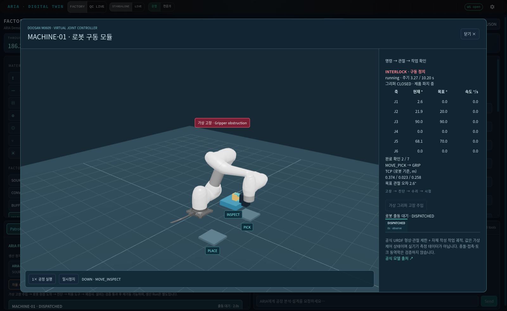
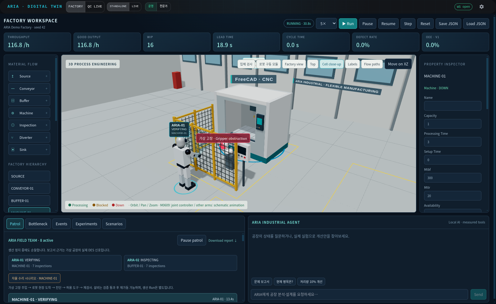
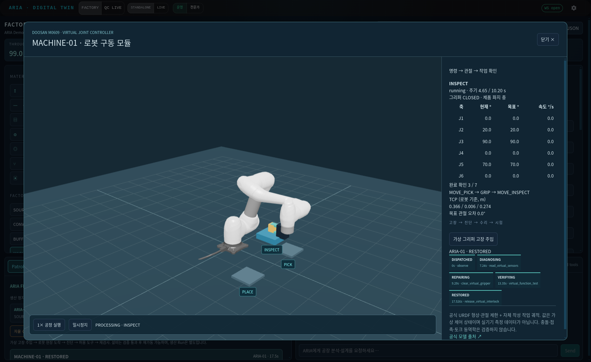
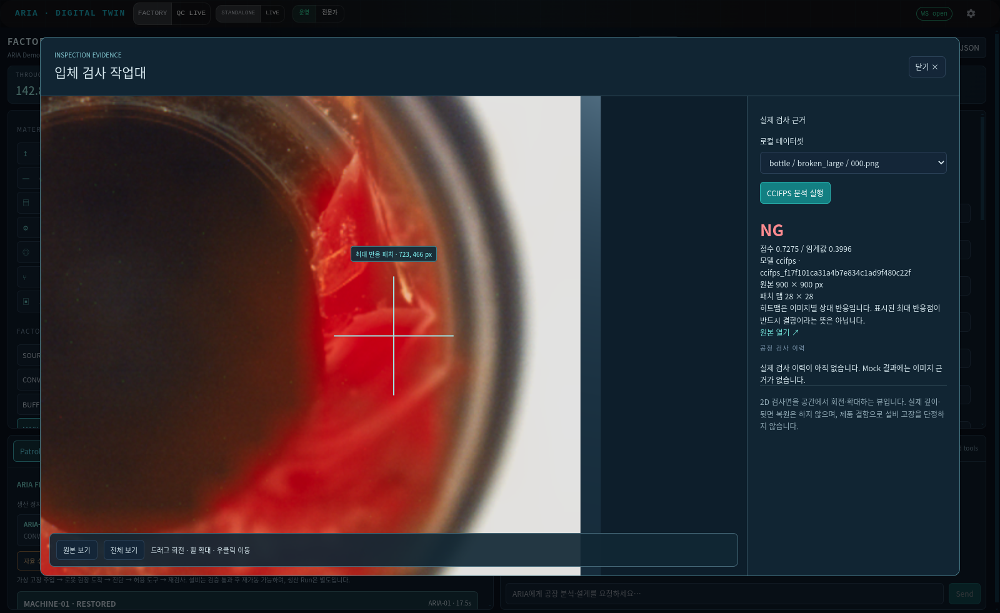

# 관절 제어 · 검사 근거 · 자율 수리

2026-09-18 구현. 가상 공정에서 **명령 → 관절 궤적 → 완료 확인 → 공정 전이**를 연결한다. 실제 하드웨어 제어 또는 두산 컨트롤러의 동역학 재현을 의미하지 않는다.

## 1. M0609 구동 모듈

[DoosanRobotics/doosan-robot2](https://github.com/DoosanRobotics/doosan-robot2)의 고정 커밋 `6c5f3ba622bfa9d6f9cffebf21fa44f57db55b48`에서 M0609 URDF, 10개 visual mesh, BSD-3-Clause 라이선스를 가져왔다. 파일별 SHA-256은 `assets/robots/doosan_m0609/source.json`에 기록한다. 상완 link_2는 3개 visual로 구성된다.

- 공식 URDF의 6축 origin, RPY, 관절 위치 범위, 속도 제한을 사용한다.
- URDF Z-up → 웹 Y-up 변환으로 같은 관절 상태를 공장과 모듈 화면에 표시한다.
- 120 mm 그리퍼와 작업대, home/pick/inspect/place 관절 목표는 ARIA에서 작성한 가상 셀 구성이다. 실제 제조사 운전 로그가 아니다.
- 각 관절은 시작/종료 속도가 0인 quintic 보간으로 움직인다. 각 이동 시간은 `1.875 × |Δq| / URDF velocity` 이상이다. 토크/가속도 제한 또는 충돌 회피를 검증했다는 뜻은 아니다.
- 순서: MOVE_PICK → GRIP → MOVE_INSPECT → INSPECT → MOVE_PLACE → RELEASE → RETURN_HOME.
- 서버는 각 단계의 목표 도달/그리퍼 상태를 확인한 `robot_ack` 이벤트를 남긴다. 7개 명령의 확인과 그리퍼 해제 전에는 제품을 다음 공정으로 보내지 않는다.
- 그리퍼 파지 중 제품 위치는 가상 TCP를 따른다. 화면 프레임 수가 공정 시간을 결정하지 않는다.
- 고장은 남은 처리 시간, 관절 위치, 명령 완료 목록을 보존하며, 복구 뒤 중단 지점부터 재개한다.
- 모듈 연결은 Machine/Inspection, capacity=1에 한정한다. 기존 시간 기반 설비는 `robot_model=""`로 유지된다.

Factory에서 설비 선택 → **로봇 구동 모듈** → **M0609 모듈 연결 검토** → Apply → **1× 공정 실행**. 현재 워크스테이션의 MACHINE-01에는 연결해 두었다. 연결 변경은 기존과 같이 공정 초기화가 수반된다.

## 2. 검사 대상을 공간에서 확인

**입체 검사**는 기존 2D 검사 이미지를 회전·확대할 수 있는 공간 검사면에 표시한다. 원본과 실제 CCIFPS 패치 히트맵 전환, 최대 반응 영역 확대, 원본 픽셀 좌표, 점수/임계값/모델 run ID를 제공한다. 깊이·가려진 뒷면은 복원하지 않는다. 3D 결함 데이터셋을 새로 받지 않았다.

- 기존 로컬 CCIFPS bundle의 이미지를 분석하며, 테스트 라벨은 이미지 선택 안내용이다. 라벨 마스크를 예측 결과로 사용하지 않는다.
- 28×28 응답 맵의 최대 패치를 원본 픽셀 좌표로 변환한다. 최대 반응점은 항상 존재하므로 정상 이미지에서도 이 점을 결함이라고 단정하지 않는다.
- 히트맵 색은 이미지별 min/max 정규화이며, segmentation 임계값이나 측정된 3D 좌표가 아니다.
- 실제 공정 Inspection 모드도 근거를 남긴다. 최근 30개 검사 결과를 공정 초기화 전까지 조회한다. 기본 MOCK 결과에는 이미지 근거를 생성하지 않는다.
- 별도 미리보기 추론은 생산 모델을 수정하지 않는다. 공정 검사를 CCIFPS로 바꾸려면 Inspection 속성에서 run ID와 이미지 경로를 설정·Apply한다.
- 생성 근거는 `outputs/factory-evidence/`에 최대 200개 보존한다. 원본 해시, 원본/맵 크기, detector 점수와 임계값을 기록하며, 만료된 ID는 404를 반환한다.

## 3. 자율 수리 하네스

Patrol의 **자율 수리 시나리오** 또는 로봇 모듈의 **가상 그리퍼 고장 주입**으로 실행한다. 이것은 주입된 가상 센서 고장으로, 제품 NG를 장비 고장으로 해석하지 않는다.

| 단계 | 조건과 결과 |
|---|---|
| DISPATCHED | 설비 DOWN, 생산 인터록 유지, 순찰 로봇 출동 |
| DIAGNOSING | 로봇이 실제 경로로 접근점에 도착했을 때만 진단 시작 |
| REPAIRING | 관측 센서가 승인된 recipe와 일치하면 가상 수리 도구 1회 실행 |
| VERIFYING | 센서 재검사, 연결된 M0609는 4초 손목 시험 동작 후 원래 관절 위치 복귀 확인 |
| RESTORED | 검증 통과 후에만 생산 인터록 해제. 생산이 Pause이면 자동 Run하지 않음 |
| ESCALATED | 원인 불명, 조건 불일치, 검증 실패, 활성 제어 시간 120초 초과 시 고장 유지 |
| INTERRUPTED | 공정 초기화/모델 변경 시 오래된 수리 작업 취소; 복구 성공으로 기록하지 않음 |

가상 도구는 `clear_virtual_gripper`와 `reconnect_virtual_camera` 두 종류다. 임의 코드·셸·실물 액추에이터 호출은 없다. 순찰 Pause는 수리 진행도 멈춘다. 기존 `/patrol/fault`의 MTTR 타이머 시나리오와 분리되어, 오래된 repair 이벤트가 하네스 고장을 해제하지 못한다. 무작위 MTBF 고장은 기존 타이머 방식이고 하네스 대상은 명시적으로 주입된 recipe 고장이다.

판단은 센서 조건과 명시적 상태 전이를 사용하는 결정론적 실행기다. LLM이 원인을 추측하거나 수리 도구를 자유 생성하는 구조는 아니다. 로봇의 현장 접근 및 제어 도구 실행을 보여주지만, 수리 로봇의 손-부품 접촉/볼트 체결/물리적 수리를 계산하지 않는다.

명령·근거·로봇 ID·시각·검증 결과를 순찰 사건에 저장하고 Markdown 보고서에도 포함한다. 서버 재시작은 진행 중 가상 공정/작업을 재개하지 않으며, 저장된 사건은 interrupted로 남긴다.

## 4. 검증

- 전체 테스트 **74개 통과**, 기존 의존성 deprecation warning 13개. 프런트 빌드 성공(기존 대형 번들 경고 유지).
- 10 seed에서 각기 다른 소수점 시각에 고장 주입. **10/10 고장 중 생산 중단, 10/10 복구, 10/10 생산 재개**.
- 복구 중앙값 **21.0초**: 0.25초씩 증가하는 순찰/하네스 활성 제어 시간. 실제 하드웨어 시간 또는 측정한 UI wall time이 아니다.
- 처리 설정 3초의 로봇 작업 주기는 이동·파지·해제를 합쳐 **10.2초**.
- 2,001개 표본의 최대 관절 속도/URDF 제한 비율 **0.375**. IK/동역학/충돌/실장비 시험의 통과율이 아니다.
- 소수점 중단·재개 실험에서 발견한 마지막 명령과 제품 완료 이벤트의 미세 시각 순서 문제를 수정하고 회귀 테스트로 고정했다.
- 실제 CCIFPS `bottle/test/broken_large/000.png`: score **0.727503**, threshold **0.399646**, NG, 28×28 히트맵. 단일 샘플 확인이며 정확도 성능 추정치가 아니다.
- 브라우저에서 모델 로딩, Run, 고장 주입, 수리/검증/복구, 복구 후 생산, 검사/확대/원본 전환을 확인한다. 최종 캡처와 브라우저 검증 JSON은 아래에 저장한다.

재현:

```bash
PYTHONDONTWRITEBYTECODE=1 OMP_NUM_THREADS=4 OPENBLAS_NUM_THREADS=4 python -m pytest tests -q -p no:cacheprovider
PYTHONPATH=. python tools/benchmark_robot_harness.py --output outputs/robot_harness_benchmark.json
cd frontend && npm run build
```

원자료: [10 seed 제어 실험](benchmarks/robot_harness.json), [브라우저 검증](benchmarks/robot_harness_browser.json), [실제 수리 trace](benchmarks/robot_harness_trace.json).

## API

- `GET /api/factory/robot/model`: 공식 관절 구조·출처·가상 fixture.
- `POST /api/factory/maintenance/fault`: `{component, cause}`. cause=`gripper_jam`, `camera_disconnect`, `unknown`.
- `GET /api/factory/patrol`: 로봇 현장 상태와 maintenance trace.
- `GET /api/factory/inspection/catalog`: 로컬 실제 bundle/검사 이미지 목록.
- `POST /api/factory/inspection/preview`: `{image, run_id}`로 기존 CCIFPS 추론.
- `GET /api/factory/evidence/{id}/{original.png|overlay.png|metadata.json}`: 제한된 근거 파일 조회.


## 실제 캡처







검사 이미지 출처: MVTec Software GmbH, [MVTec AD](https://www.mvtec.com/research-teaching/datasets/mvtec-ad), bottle/test/broken_large/000.png. 해당 이미지를 포함하는 원본/히트맵 캡처 및 워크플로 GIF는 CC BY-NC-SA 4.0 조건에 따른 변형(히트맵, 공간 표시, UI 합성)이다. 로봇 모델은 별도 BSD-3-Clause 라이선스이며 `assets/robots/doosan_m0609/LICENSE`와 배포 public 폴더에도 원문을 보존한다.
