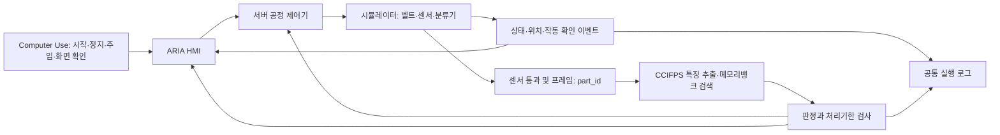

# ARIA 공정 시뮬레이션과 Computer Use 구축안

작성: 2026-09-17. 상태: 코드·공식 자료 조사에 기반한 구현 명세. 외부 시뮬레이터 설치, 물리 공정 구현, Computer Use 실조작은 아직 완료하지 않았다.

## 1. 결론

ARIA의 CCIFPS 검사기와 관제 화면을 유지한다. 먼저 기존 3D 렌더링을 복구하고 서버 중심 공정 상태를 만든다. 물리 기반 컨베이어·센서·분류기의 첫 연동 후보는 Webots로 한다. Isaac Sim은 합성 카메라 데이터·복잡한 로봇/접촉 검증이 필요할 때 호환성 검토 후 별도 도입한다.

Computer Use는 운전자가 화면을 사용하는 절차를 검증한다. 고속 센서 처리와 매 프레임 이동은 결정론적 시뮬레이터/API가 담당한다. 마우스 클릭 속도가 생산 속도나 검사 타이밍을 결정하지 않는다.

## 2. 현재 확인된 사실과 결함

| 항목 | 근거 | 현재 의미 / 필요한 변경 |
|---|---|---|
| 실제 영상 검사 | outputs/live_process_20260917_01/summary.json | bottle 12장, OK 6 / NG 6 판정. 정확도 수치 아님 |
| 결과 전송 | aria/ipc/bus.py:get_bus | 기본 core 주소 8200. 현재 8217 서버는 ARIA_CORE_URL을 명시해야 함 |
| 자동 이동 | frontend/src/hmi/scene/flowEngine.js | 결과 수신 후 제품 생성. conveyor 3200ms, dwell 1400ms, exit 700ms, lane 2000ms의 위상 애니메이션 |
| 이동 검증 | outputs/live_process_20260917_01/flow_check.json | 12개 WS 결과로 정상/불량 레인 분기 로직 확인. WebGL 시각 검증 아님 |
| 벨트 운전 조건 | frontend/src/hmi/scene/QCLine.jsx | running=connected&&!replayActive. 연결만 되어도 벨트가 운전 표시될 수 있음 |
| 표시 속도 | aria/planes/factory_line.py:_speed_mps | 기본 속도×온도 계수. 실제 엔코더 측정값이 아님 |
| 설비 고장 | server/routers/inspector.py:_feed_health | 일부 온도·진동은 sim 프록시. 실제 모터 고장 측정과 구분 필요 |
| 화면 | 이전 브라우저 검사 | 중앙 3D 미표시 미해결. 성공 조건에서 제외할 수 없음 |
| Computer Use | mcp_config.json | filesystem/system/database/huggingface만 등록. computer_use 서버 등록 없음 |
| CDP 코드 | aria/orchestration/agent_orchestrator.py:_execute_tool_via_cdp | screenshot 코드 존재. 현재 Codex 옆 브라우저 제어 연결 완료를 의미하지 않음 |
| 외부 도구 | PATH 확인 | webots/ros2/isaac-sim 실행 명령 미발견. 시스템 전체 미설치를 단정하지 않음 |

## 3. 시뮬레이터 선택 근거

| 후보 | 공식 확인 기능 | ARIA에서의 역할 | 선택 |
|---|---|---|---|
| 기존 React Three Fiber 씬 | 저장소에서 직접 확인한 이동·분기 구현 | 관제 화면, 이미지 재생 검사, UI 회귀 | 유지. 물리 충돌 시뮬레이터로 부르지 않음 |
| Webots | 공식 ConveyorBelt PROTO, Supervisor 제어 API | 벨트·제품·센서·분류기의 물리 공정, 시나리오 재현 | 첫 물리 연동 후보. 현 장비 실측 성능은 미확인 |
| Isaac Sim | Conveyor Belt Utility, ROS 2 bridge | 로봇, 센서, 고품질 카메라 기반 확장 | 후속 후보. 현재 latest 요건에 GPU RTX4080·Linux 드라이버595.58.03이 제시됨. 기존 RTX3090/550.54.14 환경에서 바로 작동한다고 보장하지 않음 |

Webots를 우선하는 것은 구현 범위와 기존 ARIA 재사용을 고려한 판단이며, 두 시뮬레이터의 성능 실험 결과가 아니다. 설치 시 버전과 자산 commit/hash를 고정한다. 공유 서버 드라이버를 자동 교체하지 않는다.

공식 근거:
- [Webots ConveyorBelt 소스](https://github.com/cyberbotics/webots/blob/master/projects/objects/factory/conveyors/protos/ConveyorBelt.proto)
- [Webots Supervisor](https://www.cyberbotics.com/doc/guide/supervisor-programming?version=master)
- [Isaac Conveyor Belt Utility](https://docs.isaacsim.omniverse.nvidia.com/6.0.1/digital_twin/warehouse_logistics/ext_isaacsim_asset_gen_conveyor.html)
- [Isaac ROS 2 구조](https://docs.isaacsim.omniverse.nvidia.com/latest/ros2_tutorials/overview/ros2_reference_architecture.html)
- [Isaac 요구사항](https://docs.isaacsim.omniverse.nvidia.com/latest/installation/requirements.html)

## 4. 목표 데이터·제어 경로

1. 서버가 run_id/part_id를 부여하고 제품을 먼저 투입한다.
2. 가상 광전센서 통과 시 capture 이벤트를 생성한다.
3. image_id/hash와 part_id를 묶어 CCIFPS 검사 요청을 보낸다.
4. 결과가 도착하면 분류기까지 남은 거리/속도로 처리 가능 여부를 판단한다.
5. 기한 내 결과는 OK/NG 분류기로 보내고 실제 도달 센서로 작동을 확인한다.
6. 미응답·ERROR·기한 초과는 HOLD/보류로 보낸다. 누락 제품을 정상 처리하지 않는다.
7. ARIA는 같은 part_id의 실제 시뮬레이터 위치·상태를 그린다. 별도 프론트 타이머를 공정의 기준 시계로 쓰지 않는다.

초기에는 이미지 재생 모드와 가상 카메라 모드를 분리한다. 이미지 재생은 기존 MVTec 데이터를 사용한 제어 검증이다. 가상 카메라 입력은 분포가 달라 기존 bank의 정확도를 보장하지 않는다. 별도 정상 합성 train/calibration과 보류 test를 사용하고 기존 결과와 섞지 않는다. 결함 GT는 평가 로그에만 두고 추론·제어 입력에서 제외한다.

## 5. 공정 상태와 고장 정의

공정 상태: STOPPED → READY → RUNNING → DRAINING → STOPPED. 별도 PAUSED, FAULT, ESTOP. WebSocket 연결 상태는 별도 필드다.
제품 상태: SPAWNED → INFEED → AT_CAMERA → INSPECTING → DECIDED → DIVERTING → EXIT_OK/EXIT_NG/HOLD.

- Pause: 시뮬레이션 clock·이동 정지. 실행 중 추론 결과는 저장하되 재개 시 기한을 다시 일관되게 판단한다.
- Stop: 새 투입을 중단하고 명시한 drain 정책대로 기존 제품 처리.
- ESTOP: 가상 구동 정지와 래치. 고장 제거·명시적 reset 후 READY. 자동 재시작 금지.
- 제품 불량: 흠집·깨짐 이미지에 대한 CCIFPS 판정.
- 설비 고장: jam, 센서 누락, 분류기 응답 실패. 위치/시간/센서로 감지하며 CCIFPS 하나로 모터 고장을 진단했다고 하지 않는다.
- API 주입 고장은 source=simulation, injected=true와 시작·해제 시간을 기록한다.

## 6. 도구 구성과 Computer Use 절차

### 연결할 도구 (신규 인터페이스 제안, 현재 사용 가능 API로 오인 금지)

| 계층 | 도구 계약 | 역할 |
|---|---|---|
| 관찰 | capture_screen(target_id), inspect_console(target_id) | 화면 PNG·콘솔·viewport 크기·시각 기록 |
| 화면 조작 | click(target_id,x,y), type, key, scroll | 최신 캡처에서 확인한 버튼만 조작 |
| 공정 | get_state, start_run, pause, resume, stop_run | 서버 상태 전이, run_id와 명령 ACK |
| 고장 | inject_fault(run_id,type,part_id,duration), clear_fault | 시뮬레이션 실행에만 적용 |
| 증거 | capture_clip, export_events, assert_scenario | 시간에 따른 위치·판정·분기 증거 |

브라우저 UI: 소유한 Chrome 세션의 CDP 연결을 우선 검토한다. OS 앱(Webots GUI): screenshot/mouse/keyboard MCP를 같은 데스크톱 세션에 연결해야 한다. 서버에 DISPLAY가 없는 셸의 pyautogui는 사용자의 옆 브라우저를 제어하지 못한다. Xvfb 같은 별도 가상 화면을 사용하면 원격 화면 스트림도 제공하고 사용자 화면과 다름을 명시한다.

기존 mcp_config.json에 이름만 등록하는 것으로 끝내지 않는다. 서버 구현 경로·실행 Python·의존성·대상 세션을 확인하고 tools/list → screenshot → 사용자에게 해당 화면 표시 → 클릭 → 사후 캡처를 통과시킨다. 현재 도구가 연결되지 않아 이번 조사는 공식 웹 검색과 로컬 코드 분석으로 수행했다. Computer Use로 검색·조작했다고 주장하지 않는다.

### 한 시나리오의 조작 순서

1. 대상 창/URL과 run 상태를 읽고 전체 캡처한다.
2. 캡처에서 모델 bundle과 시나리오를 확인해 선택한다.
3. 시작 버튼 클릭 전 캡처를 저장하고 클릭 후 RUNNING 표시 및 서버 ACK를 확인한다.
4. 3초 간격 캡처/짧은 영상과 part_id 위치 로그를 비교한다. 화면 픽셀 변화만으로 이동 성공을 판정하지 않는다.
5. 고장 주입 패널에서 simulation 표시·fault 종류를 확인하고 한 번만 주입한다.
6. 경고 표시, 속도/구동 상태, 부품 처리 결과를 각각 확인한다.
7. 고장 해제 → reset → READY → 명시적 재시작을 검증한다.
8. Stop 후 투입 중단·잔여 처리·최종 카운터를 확인하고 증거를 저장한다.

각 클릭/타이핑 전 최신 캡처. 분당 30회 미만. 타깃 창이 바뀌거나 버튼이 확인되지 않으면 재캡처한다. 화면 조작 재시도는 최대 2회로 제한하고 중복 시작은 command_id로 차단한다. 검사 판정은 VLM 화면 판독으로 대체하지 않는다.

## 7. 구현 순서와 통과 기준

| 단계 | 작업 | 통과 기준 |
|---|---|---|
| G0 | 현재 3D 표시 복구 | 제품·벨트·분류기 표시, WebGL 오류 없음, 시작/정지 두 화면과 영상 확보 |
| G1 | 서버 기준 상태·제품 수명주기 | 결과보다 투입이 먼저 발생, 동일 run_id/part_id 전 구간 추적, IDLE 벨트 정지 |
| G2 | Computer Use 연결 | 캡처·시작 클릭·상태 확인·정지 클릭·사후 캡처 모두 실제 성공 |
| G3 | Webots 최소 셀 | 벨트1/카메라1/진입·출구센서/분류기1, 물체 위치와 센서 통과 일치 |
| G4 | CCIFPS 어댑터 | 동일 image/hash 입력의 기존 검사와 score 일치, GT 미입력 |
| G5 | 고장 시나리오 | 아래 고정 목록 수행, 실패도 기록. 미해결 항목을 성공 처리하지 않음 |
| G6 | 10분 내구 운전 | 투입=OK+NG+HOLD+진행중, 중복0·무기록 유실0, p95 지연/FPS/자원 기록 |

G0의 빈 화면은 콘솔 예외 → Canvas 크기/WebGL context → Suspense/외부 자원 → 최소 geometry → 씬 단계적 복구 순으로 조사한다. 폰트 문제로 미리 단정하지 않는다.

## 8. 고정 시나리오와 수치

최초 검증 목록은 7개, 정상 운전은 1 Hz·12개로 시작한다. 다음 값은 측정 결과가 아니라 제안한 테스트 입력/통과 기준이다.

| ID | 입력 | 확인 |
|---|---|---|
| S01 | 정상 운전, 12개 | 투입12·종료12, 부품별 판정과 출구 일치 |
| S02 | 기존 정상/결함 이미지 고정 순서 | GT와 예측 분리, FP/FN 기록, 명령과 실제 분기 일치 |
| S03 | 추론 지연 2000ms 주입 | 실제 도달 기한 초과 제품 HOLD, late 결과 재분기 금지 |
| S04 | 센서 이벤트 1건 누락 | 진행중 제품 추적 timeout, 무기록 소실0 |
| S05 | 벨트 jam 3초 | 위치 정지·구동 명령 차이 검출, 경고·정지·복구 로그 |
| S06 | 분류기 ACK 누락 1건 | 명령 성공으로 집계하지 않음, HOLD/FAULT 정책 실행 |
| S07 | WS 단절 3초 및 재연결 | stale 표시, snapshot+sequence로 재동기화, 중복 제품0 |

자원 시작값: 시뮬레이션 fixed step 1/60s, 표시 목표30FPS, 상태 방송10Hz, 이미지 검사1Hz. 실시간 배율·step 지연을 측정해 가능 여부를 판단한다. 여유 GPU 확인 후 시뮬레이터와 CCIFPS를 각각 한 GPU에 배치한다. 이 값은 실제 장비 제어 주기를 보장하지 않는다.

deadline = trigger 시점 + 센서~분류기 거리 / 벨트 속도 - actuator 여유시간. 가변 속도·정지에서는 이동 거리 적분에 따른 도달 예측을 사용한다. 시뮬레이션 시간과 wall-clock을 함께 남겨 추론 지연과 pause를 혼동하지 않는다.

기록: run_id, scenario_id, seed, source/config/bank hash, part_id, frame_id/hash, event_seq, sim_time, monotonic_ns, state_before/after, commanded/actual position, score, threshold, predicted_verdict, route_command, route_ack, exit_sensor, fault_source. GT는 별도 평가 테이블.

집계: 이미지 FP/FN/AP는 라벨·평가 함수가 정의된 경우만; 공정은 throughput/min, p50/p95/p99 지연, deadline miss, HOLD, 분류기 실패, 중복·유실, FPS, real-time factor, GPU peak memory, CPU/RAM. 최종 저장은 scenario_results.csv, events.jsonl, screenshots/, video/, environment.json, REPORT.md.

## 9. 이번 작업의 완료 범위

공식 시뮬레이터 후보 조사, 실제 ARIA 코드 연결 문제 정리, Computer Use 연결 계약, 구현 순서·고정 시나리오·증거 기준을 작성했다. simulator 설치와 신규 모델 학습은 하지 않았다. 먼저 실행할 작업은 G0~G2이며, 외부 시뮬레이터 도입 전에도 진행 가능하다.
